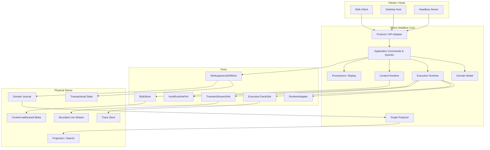
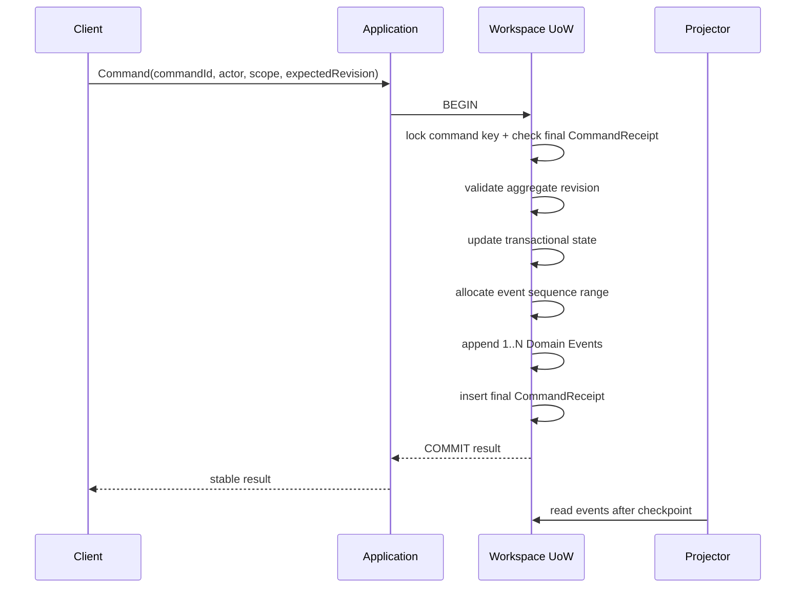
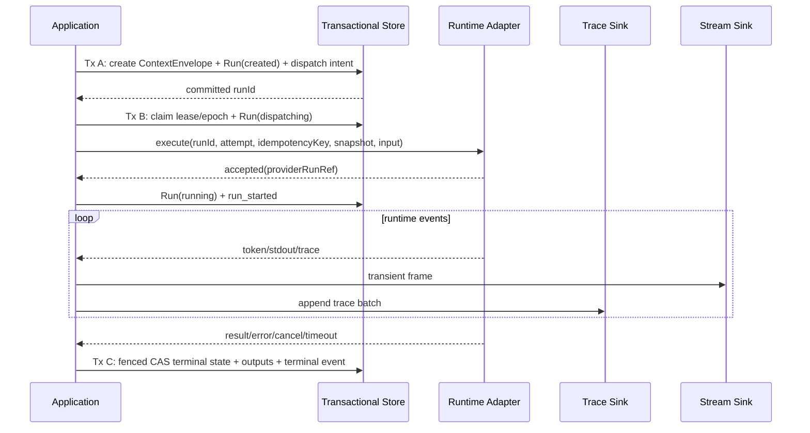

# Rhiza 技术架构设计书 v3.0

> 副标题：事件驱动工作图谱与可移植运行时  
> 文档状态：目标架构基线 / 可施工设计  
> 日期：2026-08-18  
> 战略来源：`0815Rhiza_三步走开发战略与架构重构规划_v2.3_高性能与跨平台优化.md`  
> 适用范围：当前 Legacy M0–M6 重构、Phase 1 收口，以及 Phase 2/3 的稳定基础  
> 决策优先级：本设计书高于旧 M0–M6 技术验收口径；0815 v2.3 仍是产品战略与长期路线基线

---

# 0. 执行摘要

Rhiza 的最高层抽象是长期存在的 `Workspace`，而不是 `Conversation`。Conversation、Task、Artifact、Knowledge、Decision、Execution 与 Extension 都是 Workspace 中的 Domain Object，并可投影到统一 Work Graph。

本设计采用以下基础结构：

```text
Transactional State + Append-only Domain Journal
                ↓
      Incremental Projections
                ↓
Graph / Context / Search / Task / UI Read Models

ExecutionRun
  ├─ Run Lifecycle Domain Event  → Domain Journal
  ├─ Raw Execution Trace         → Trace Store
  └─ Live Token / stdout         → Transient Stream

Resource → immutable ResourceVersion → content-addressed Blob
                                      ↓
                              Context Manifest
                                      ↓
                                 ExecutionRun
                                      ↓
                                  Provenance
```

本设计解决 0815 v2.3 与当前实现之间的主要矛盾：

1. 旧、新 M0–M6 使用同一名称，导致验收语义冲突。
2. Graph 删除会物理删除消息与 Manifest，破坏历史与 Replay。
3. `AuditEvent` 不能替代 Domain Event Journal。
4. 模型调用没有持久化 `ExecutionRun`，失败、取消、超时会消失。
5. Graph 仍是 Conversation 专用结构且必须全量加载。
6. Context Planner 在主路径同步扫描整个 Workspace。
7. Context Manifest 缺少真实 ResourceVersion、content hash 与 compiler version。
8. Host、Trace、Bundle 等前置约束被放到后置迁移步骤。
9. M6 的五个语义 Spike 与四个物理 Spike 没有形成统一 Gate。
10. 性能标准缺少可自动判定的阈值与固定测试方法。

物理实现保持克制：Phase 1 默认仍是单进程、模块化单体、一个 PostgreSQL 实例。Domain Journal、Trace Store 和 Transient Stream 使用独立 contract、表与 retention，但不引入 Kafka、微服务或完整 CQRS 平台。

---

# 1. 文档地位与命名空间

## 1.1 三套名称必须分离

从本设计书开始，产品路线、迁移施工与架构验收不再共享编号。

| 命名空间 | 含义 | 示例 |
| --- | --- | --- |
| `Legacy-M0..M6@2026-08-14` | 0815 之前已经实现的工程与产品基线 | Legacy-M1 Chat Parity |
| `P1-M0..M8` | 0815 战略中的 Phase 1 产品里程碑 | P1-M3 Conversation Runtime |
| `R0..R8` | 本设计书定义的架构迁移批次 | R3 ExecutionRun Migration |
| `G0..G8` | 每个迁移批次必须通过的自动化 Gate | G3 Trace Flood Gate |

现有 `docs/M0_ACCEPTANCE.md` 至 `docs/M6_ACCEPTANCE.md` 统一视为 `Legacy-*` 证据。它们可以作为 Characterization Baseline，但不能证明 v3.0 架构 Gate 已通过。

## 1.2 文档治理

- 0815 v2.3：产品战略、三步走路线和长期约束。
- 本文：目标技术架构、数据模型、事务边界、迁移顺序和 Gate。
- `docs/architecture.md`：当前已部署实现的现状说明；不得把目标架构写成当前事实。
- 后续 ADR：记录单项不可逆或高成本决策。
- 后续 `docs/architecture-gates/G*.md`：保存 Gate 的自动化结果和人工证据。

## 1.3 基线冻结

当前提交 `b29d94f` 应标记为 `pre-0815-engineering-baseline`，而不是新架构 M6 complete。旧 M6 仍有一小时浏览器稳定性和真实用户可用性两项未完成证据，必须原样保留。

---

# 2. 架构目标、非目标与不变量

## 2.1 架构目标

1. 让 Conversation、Task、Artifact、Execution 和 Extension 共用稳定的 Workspace Kernel。
2. 所有关键变化可追溯、可解释、可回放、可迁移。
3. 外部 Runtime 成功、失败、取消、超时和崩溃都有稳定身份和历史。
4. Graph 是增量、异步、可重建的 Projection，不保存唯一业务真相。
5. Context 是独立 Runtime，Manifest 是不可变执行证据。
6. 高频 Trace 不进入业务事务热路径。
7. Core 可 Headless 运行，OS 能力通过 Host Runtime Port 注入。
8. Workspace 可在数据库、机器与操作系统之间进行逻辑迁移。

## 2.2 明确非目标

Phase 1 不实现：

- 分布式事件总线；
- Kafka 或独立流平台；
- 全量 Event Sourcing；
- 微服务拆分；
- 通用 Agent orchestration engine；
- 任意第三方代码沙箱；
- Public Extension Marketplace；
- Rhiza 自有 Code Harness；
- 完整 ABAC/Policy Engine。

## 2.3 架构不变量

### I-01 Workspace 高于 Conversation

所有长期对象都必须拥有 `workspace_id`。Conversation 不得成为 Task、Artifact、Resource 或 Execution 的所有者根。

### I-02 Domain Event、Trace、Stream 三分

```text
Domain Event       = 业务事实，低频，可靠，事务一致，长期保留
Execution Trace    = 执行细节，高频，可批量，可分级保留
Transient Stream   = 实时帧，有界缓冲，可合并，可丢弃
```

任何 token chunk、stdout chunk、file-read trace 都不得进入 `workspace_events`。

### I-03 Current State + Journal，不做全量 Event Sourcing

- Transactional State 是 Command 校验和当前业务状态的高效来源。
- Domain Journal 是不可变的语义历史。
- 明确声明为 Projection 的数据必须能从 Journal + versioned snapshot 重建。
- 缓存、布局、全文索引和临时 UI 状态不要求事件化。
- State、Journal 和 Command Receipt 必须在同一数据库事务内提交。

### I-04 历史默认不物理删除

普通删除语义统一为：

```text
archive / tombstone / relation.retracted / projection.removed
```

真正的硬删除只能由显式、不可逆、带权限的 Purge Workflow 执行。Purge 必须生成最小化审计事实、枚举受影响引用，并把无法保留的 Provenance 标为 `redacted` 或 `purged`，不能静默断链。

可删除正文、Secret、PII 和原始 Prompt 不得直接进入永久 Journal payload，只能以受控 `blob_ref + digest` 引用。敏感 Blob 使用 workspace/resource data key 加密；Purge 删除 Blob 并销毁 key，长期表只保留不含原文的 identity、digest、purge reason 与 broken-reference marker。已经导出到用户控制范围之外的 Bundle 无法被 Rhiza 召回，Purge UI 和导出协议必须明确提示这一边界。

### I-05 Graph 是 Projection

删除 UI Graph Node 只能移除 Projection 或布局，不得删除 Domain Object。

### I-06 Manifest 不可变

Context Manifest 创建后，普通 Application role 禁止 UPDATE/DELETE。更正只能创建新 Manifest，并使用 `supersedes_ref` 建立关系。特权 Purge 过程可以 crypto-shred 其正文 Blob，并保留不含正文的 Manifest tombstone；不得直接级联删除 identity 与引用关系。

### I-07 Resource identity 与位置解耦

绝对路径、数据库 row id、Windows/macOS/Linux path separator 都不能进入 Resource identity。

### I-08 Core 必须 Headless

Domain/Application 不得 import React、Express、Electron、Tauri、PTY、`child_process`、OS credential API 或具体模型 SDK。

### I-09 外部调用不能参与本地数据库事务

Provider/Agent/CLI 调用位于两个本地事务之间，通过 ExecutionRun 状态机表达，不做跨系统分布式事务。

### I-10 所有长期 contract 必须版本化

Event、Command、Run、Manifest、ResourceVersion、Graph Projection、Bundle 与 Host Protocol 都必须有 schema/contract version。

---

# 3. 总体架构



## 3.1 推荐包结构

```text
packages/
  domain/                    # Entity、Value Object、Domain Rule、Port types
  application/               # Commands、Queries、UoW orchestration
  contracts/                 # Event/Command/API JSON Schema 与 wire types
  host-protocol/             # Host capability 和 HostRuntimePort
  execution-runtime/         # ExecutionRun 状态机、trace/stream routing
  context-runtime/           # Contributor、Planner、Compiler、Manifest
  graph-projection/          # Universal graph reducers/query contracts
  provenance/                # Replay、revision、provenance query
  portable-bundle/           # workspace.rhiza export/import
  infrastructure-postgres/   # PostgreSQL adapters
  infrastructure-embedded/   # 具真实事务的 embedded adapter
  runtime-adapters/          # LibreChat/OpenAI/Anthropic/CLI adapters
  host-node/                 # Node/server host adapter
  web/                       # React client
  server-host/               # Express composition root
```

Phase 1 可以先在现有仓库中建立这些目录，不要求拆成独立发布包，但 TypeScript project references、ESLint boundary rule 和 CI dependency test 必须按包边界执行。

## 3.2 依赖方向

```text
Web / Server Host / Desktop Host
              ↓
         Application
              ↓
            Domain

Infrastructure ──implements──> Domain/Application Ports
Runtime Adapter ─implements──> Execution Runtime Port
Host Adapter    ─implements──> Host Runtime Port
```

禁止依赖：

```text
Domain → Application
Domain → React / Express / Node fs / concrete SDK
Application → Web / Desktop / concrete database
Web → database
Runtime Adapter → UI state
Graph Projection → synchronous Domain write
```

---

# 4. Identity、Scope 与 Object Reference

## 4.1 ID 原则

- 保留现有已由 Rhiza 生成的 UUID，不为“看起来更整齐”而重新生成主键。
- 新对象使用 application-generated UUID；v7 可作为实现优化，但 ID 语义必须保持 opaque。
- 外部 Conversation/Message/Run ID 只能进入 `ExternalRef`。
- 数据库自增值只用于局部排序或内部索引，不作为 portable identity。

## 4.2 基础引用

```ts
type ObjectRef = {
  workspaceId: string;
  objectType: string;
  objectId: string;
  versionId?: string;
};

type ActorRef = {
  actorType: 'human' | 'system' | 'executor' | 'extension';
  actorId: string;
};

type ScopeRef = {
  scopeType: 'user' | 'workspace' | 'conversation' | 'run';
  scopeId: string;
};

type ExternalRef = {
  ownerType: string;
  ownerId: string;
  namespace: string;
  externalType: string;
  externalId: string;
};
```

## 4.3 Object Registry

所有可进入 Graph、Context、Provenance 或 Extension 的对象都注册到：

```text
workspace_objects
  object_id
  workspace_id
  object_type
  revision
  lifecycle_status
  created_by_actor_ref
  scope_ref
  created_at
  updated_at
```

类型特有内容继续存放在 Conversation、Message、Task、Artifact、Resource 等专用表。Object Registry 提供统一引用，不把所有对象压入一个巨型 JSON 表。

## 4.4 Scope v0

Phase 1 只实现最小 Scope：

```text
user
workspace
conversation
run
```

Scope 是未来 Permission Policy 的 seam。当前 Command 必须携带 ActorRef 与 ScopeRef，但只执行 ownership/membership 和 Workspace 边界校验，不提前建设完整 Policy Engine。

---

# 5. Transactional State 与 Domain Event Journal

## 5.1 Event Envelope

Rhiza 内部事件信封采用 CloudEvents 1.0 的核心语义，但增加 Workspace 顺序、Command 幂等与因果字段。

```text
workspace_events
  event_id                 uuid
  workspace_id             uuid
  sequence                 bigint
  ce_specversion           text        # fixed to CloudEvents 1.0 on wire
  rhiza_envelope_version   text
  event_type               text
  event_source             text
  subject                  text
  data_schema              text
  aggregate_type           text
  aggregate_id             uuid
  aggregate_revision       bigint
  actor_ref                jsonb
  scope_ref                jsonb
  command_id               uuid
  event_index              integer
  causation_id             uuid?
  correlation_id           uuid?
  payload                   jsonb
  occurred_at              timestamptz
  recorded_at              timestamptz
```

约束：

```text
PRIMARY KEY(event_id)
UNIQUE(workspace_id, sequence)
UNIQUE(workspace_id, command_id, event_index)
NOT NULL(event_type, event_source, data_schema, payload)
```

`event_source + event_id` 必须全局唯一。HTTP 或未来消息传输时，`event_id/event_source/event_type` 分别映射为 CloudEvents `id/source/type`，wire `type` 使用 `dev.rhiza.<event_type>.v<major>`；数据库内部保留显式列，避免每次查询都解析完整 payload。

## 5.2 Workspace sequence

使用 `workspace_event_heads(workspace_id, current_sequence)` 在事务中按本次事件数量原子预留 sequence range。不得直接依赖 PostgreSQL sequence 无间隙特性。

同一 Workspace 的 Domain Command 在 event head 上短暂串行化。Trace 不走该锁，因此不会因 token/stdout 数量放大业务写竞争。

## 5.3 Command Receipt 与幂等

```text
command_receipts
  workspace_id
  command_id
  command_type
  status                   committed | rejected
  result_ref               jsonb?
  committed_sequence_from  bigint?
  committed_sequence_to    bigint?
  created_at
  completed_at

UNIQUE(workspace_id, command_id)
```

相同 `command_id` 重试时：

- 已 committed：返回原结果；
- 已 rejected：返回稳定错误；
- 不得重复追加 Domain Event。

实现时先取得 `(workspace_id, command_id)` 的事务级 advisory lock，再查询 Receipt。首个事务完成 State/Event 写入后，在同一事务插入最终 Receipt；并发重复请求等待锁，随后读取已提交 Receipt。不存在跨事务持久化的 `accepted/in_progress` Receipt，因此不会产生无法判断的永久 pending 状态。

## 5.4 Append-only 数据库保护

- Application role 只有 `SELECT/INSERT` journal 权限。
- 对 `UPDATE/DELETE/TRUNCATE` 建数据库触发器或权限防护并在测试中验证。
- Event schema migration 只新增兼容字段或创建新 event type/schema；不原地改写历史 payload。
- Audit Log 与 Domain Journal 分开保留。Audit 可记录管理操作和安全访问，但不能替代业务事实。

## 5.5 Event Catalog v1

```text
workspace.created

conversation.created
message.created
message.revision_created
branch.created

relation.created
relation.retracted
object.archived
object.restored
object.tombstoned

resource.registered
resource.version_created
resource.location_changed

context.selection_changed
context.manifest_created

execution.run_created
execution.dispatch_started
execution.run_started
execution.cancel_requested
execution.run_completed
execution.run_failed
execution.run_cancelled
execution.run_timed_out
execution.run_interrupted

artifact.registered
```

Event type 使用稳定小写命名。破坏性 schema 变化产生新 major `data_schema`，必要时产生新 event type；新增可选字段可保持 event type 不变。

## 5.6 普通 Command 事务



Projection 不进入 Command 主事务。

## 5.7 Versioned Snapshot Contract

Snapshot 只用于加速重放，不替代 Domain Event：

```text
WorkspaceSnapshot
  snapshot_id
  workspace_id
  source_sequence          # snapshot 包含到此 sequence 的已提交事实
  state_schema
  state_digest
  blob_ref
  created_at
```

Snapshot 必须从一个一致性数据库快照生成，并在登记前验证 `state_digest`。重建固定为：

```text
load latest compatible snapshot
→ verify digest/schema/source_sequence
→ replay events where sequence > source_sequence
→ compare aggregate/projection checksums
```

Legacy backfill 先生成带 fixture digest 的 baseline snapshot，再追加显式 backfill events。R2 contract test 必须证明“任意已登记 snapshot + tail replay”与 current state/projection 等价。

---

# 6. ExecutionRun 与 Runtime Architecture

## 6.1 核心模型

```text
ModelSpec
  model_spec_id
  declared_model_id
  contract_version
  capabilities
  metadata

ProviderEndpoint
  provider_endpoint_id
  provider_type
  endpoint_identity
  config_version
  credential_ref
  metadata

ExecutorProfile
  executor_id
  executor_type
  capability_descriptor
  host_requirements

ExecutionRun
  run_id
  workspace_id
  executor_ref
  assignment_ref?
  run_group_ref?
  parent_run_ref?
  model_spec_ref?
  provider_endpoint_ref?
  routing_decision_ref?
  context_manifest_ref
  runtime_snapshot_ref
  input_refs
  output_refs
  status
  dispatch_attempt
  dispatch_idempotency_key
  provider_run_ref?
  lease_owner?
  lease_epoch
  lease_expires_at?
  heartbeat_at?
  created_at
  started_at?
  finished_at?
  error_code?
  telemetry_summary
```

状态机：

```text
created → dispatching → running → completed
  │          │            ├──────→ cancel_requested → cancelled
  └──────────┴────────────→ cancel_requested
          │              ├──────→ failed
          │              ├──────→ timed_out
          │              └──────→ interrupted
          └─────────────────────→ interrupted
```

终态不可回退。Retry 和 Regenerate 创建新 Run，并通过 `parent_run_ref` 或 provenance relation 关联旧 Run。`cancel_requested` 不是终态；只有 Adapter 确认取消、运行自然结束或超时策略完成后，才能进入相应终态。

## 6.2 Durable Dispatch、Lease 与 Fencing

外部 Agent、CLI、Tool 或可能产生副作用的 Provider 必须通过 durable dispatch intent：

1. 创建 `Run(status=created)` 与不可变执行规格。
2. Dispatcher 用 CAS 抢占 lease，递增 `lease_epoch` 和 `dispatch_attempt`，转为 `dispatching`。
3. 每个 attempt 生成稳定 `dispatch_idempotency_key`；Adapter 支持时必须透传给 Provider。
4. Provider 接受后保存 `provider_run_ref`，再转为 `running`。
5. Heartbeat 续租；只有当前 `lease_owner + lease_epoch` 能提交 trace cursor、output 或 terminal state。
6. 旧 epoch 的迟到回调只能作为 trace 保存，不得覆盖新 attempt 或终态。

崩溃恢复规则：

- `created`：可以安全派发；
- `dispatching` 且没有 Provider idempotency/查询能力：不得自动重复副作用调用，转 `interrupted` 并要求人工或 Adapter reconciliation；
- `dispatching/running` 且有 `provider_run_ref`：先查询/接管外部 Run，再决定续跑或终结；
- 已发送 cancel 的 Run 保持 `cancel_requested`，迟到成功结果按 policy 记录为 late result，不自动产生业务 Effect；
- Provider 不支持幂等时，UI/API 必须明确显示“重试可能重复执行/计费”。

Stop 可以发生在 `created`、`dispatching` 或 `running`。Dispatcher 必须在 claim lease 前、真正发送外部请求前、收到 Provider accepted 后三个边界重新读取 cancellation/fencing 状态：

- `created → cancel_requested`：不得派发，直接收束为 `cancelled`；
- `dispatching → cancel_requested` 且尚未发送：不得发送，收束为 `cancelled`；
- 已发送但尚无 `provider_run_ref`：等待 Adapter ack/reconcile，禁止重复派发；
- accepted 后才观察到取消：立即使用 `provider_run_ref` 请求取消，并按 late-result policy 收束。

## 6.3 M3/M4 依赖闭环

为避免 ExecutionRun 与完整 Context Planner 循环依赖，定义两级 contract：

```text
ContextEnvelope v0
  immutable input/resource version refs
  content hashes
  created_at
  compiler_contract_version

ContextManifest v1 extends ContextEnvelope
  contributors
  candidates
  selected items
  reason / priority
  planner version
  compiler version
  token estimates
  compiled payload digest
```

ExecutionRun 始终单向引用 `context_manifest_ref`。Manifest 不回写 `run_id`；反向关系通过 Run 查询，避免不可变对象与 Run 创建顺序互锁。

R3 先支持 ContextEnvelope v0，R5 再升级为 Manifest v1。

## 6.4 三段式本地事务与外部执行



如果进程在任一阶段崩溃，Recovery Worker 按 status、attempt、lease epoch、heartbeat、Provider idempotency/query capability 执行前述恢复规则，不能只凭超时盲目重新派发。

## 6.5 Runtime Adapter Contract

```ts
interface RuntimeAdapter {
  describe(): Promise<RuntimeCapabilityDescriptor>;
  execute(spec: ExecutionSpec): AsyncIterable<RuntimeNativeEvent>;
  reconcile?(providerRunRef: string): Promise<RuntimeReconciliation>;
  cancel(runId: string): Promise<void>;
}
```

Adapter 负责协议归一化，不拥有 Rhiza Domain：

- Provider-native request/response；
- Model/endpoint capability discovery；
- Token、reasoning、tool call 与 provider metadata 归一化；
- Cancel/timeout 映射；
- 不直接写 Message、Manifest、Graph 或 Workspace state。

现有 `AIRuntime`、`ProviderRuntime` 和 SSE 事件可迁移为这一 contract 的第一版实现。

## 6.6 Secrets 与 snapshot

- `credential_ref` 只引用 SecretVault/Host credential port。
- Runtime snapshot 保存可重放的非秘密配置及其 digest。
- API Key、OAuth token、自定义 secret header 永不进入 Event、Manifest、Trace 或 Bundle。
- Provider response/trace 在进入 TraceSink 前执行结构化 redaction。

---

# 7. Execution Trace 与 Transient Stream

## 7.1 三种记录类型

```text
RunLifecycleDomainEvent
ExecutionTraceRecord
TransientFrame
```

禁止使用一个含糊的 `ExecutionEvent` 同时表示三者。

## 7.2 Trace schema

```text
execution_traces
  trace_id
  run_id
  dispatch_attempt
  lease_epoch
  trace_sequence
  trace_type
  timestamp
  payload_or_blob_ref
  schema_version
  retention_class
  stale_attempt

UNIQUE(run_id, lease_epoch, trace_sequence)
```

每个 attempt 独立维护 trace cursor。旧 lease 的迟到 trace 设置 `stale_attempt=true`，可按 retention policy 保存但不参与当前 Run 进度、结果或默认 UI 时间线；Inspector 可显式切换查看历史 attempt。

`retention_class`：

```text
debug-short
operational
provenance
security-audit
```

Raw token 默认不是 provenance；最终模型输出、tool effect、artifact 与关键错误通过 Domain/Provenance 模型保存。

## 7.3 Batch 与 backpressure

`ExecutionTraceSink.appendBatch()` 必须支持：

- `maxQueueSize`；
- `maxBatchSize`；
- `flushIntervalMs`；
- `exportTimeoutMs`；
- `ForceFlush`；
- `Shutdown`；
- queue depth、processed、dropped、timeout 和 export latency metrics。

Phase 1 默认建议值：

```text
maxQueueSize       = 2048 records
maxBatchSize       = 256 records
flushIntervalMs    = 1000
exportTimeoutMs    = 10000
```

队列满时：

- Domain Event 绝不丢失；
- provenance-class trace 必须同步降速或落 spill buffer；
- debug trace 可以采样/丢弃并增加 `queue_full` metric；
- 不得阻塞 ExecutionRun terminal transaction。

## 7.4 Transient Stream

Transient Stream 使用 per-run bounded ring buffer：

```text
maxFramesPerRun = 2048
```

token/progress 可以合并；慢订阅者只保证从可用窗口内续读。最终结果以 ExecutionRun output 和 Message/Artifact 为准，不依赖 SSE 完整到达。

---

# 8. Resource 与 Content-addressed Storage

## 8.1 Resource 模型

```text
Resource
  resource_id
  workspace_id
  resource_type
  current_version_id
  origin_metadata
  created_at

ResourceVersion
  resource_version_id
  resource_id
  ordinal
  content_digest
  canonicalization_version
  blob_ref
  byte_size
  media_type
  metadata_digest
  created_at
```

`origin_metadata` 可以记录本机路径、URL、Git commit 或外部系统 ID，但只是位置和来源提示，不参与 identity。

## 8.2 Digest

统一格式：

```text
sha256:<64 lowercase hex>
```

导入和读取顺序：

1. 验证 descriptor size；
2. 计算 SHA-256；
3. 比较 digest；
4. 校验 media type；
5. 再做解析、索引和反序列化。

## 8.3 Canonicalization

- 原始二进制：对原始 bytes 计算 digest。
- 文本：默认 UTF-8 bytes，不自动改换行；规范化结果作为派生版本保存。
- JSON：需要稳定身份时使用明确版本的 canonical JSON，并记录 `canonicalization_version`。
- 提取文本、summary、chunk、embedding 都是派生 materialization，不替代原 ResourceVersion。

## 8.4 Blob 生命周期

```text
write temporary blob
→ calculate and verify digest/size
→ atomically promote to final content-addressed key
→ verify final blob exists
BEGIN
  insert immutable ResourceVersion
  move Resource.current_version_id
  append resource.version_created
COMMIT
```

Blob Store 不参与 PostgreSQL 事务，因此协议必须保证“先有 immutable verified blob，再提交数据库引用”。Content-addressed put/promotion 必须幂等；不具备原子 promote 和强 read-after-write 的 Adapter 不得作为 Phase 1 primary Blob Store。

崩溃语义：

- Blob 完成、DB 未提交：产生 orphan，由基于 grace period 的 GC 清理；
- DB 已提交：final digest key 必须已经存在；
- Store 后续损坏/丢失：读路径报告 `BLOB_MISSING`，Recovery 从 Bundle/replica 修复，禁止回退到 current ResourceVersion；
- 读取不可信或冷 Blob 时重新验证 size/digest。

被 Manifest、Run、Artifact 或 Bundle pin 引用的版本不得因 current version 更新而删除。G1/G6 必须注入 temp write、promote、verify、DB commit 和 read-after-commit 故障。

---

# 9. Context Runtime

## 9.1 核心流水线

```text
Workspace/Branch/User Input
        ↓
Context Contributors
        ↓
Materialized Candidate Lookup
        ↓
Planner
        ↓
Compiler
        ↓
Immutable Context Manifest
        ↓
ExecutionRun
```

## 9.2 Ports

```ts
interface ContextContributor {
  readonly id: string;
  readonly version: string;
  contribute(input: ContributorInput): Promise<ContextCandidateRef[]>;
}

interface ContextCandidateIndex {
  query(input: CandidateQuery): Promise<ContextCandidate[]>;
}

interface ContextPlanner {
  readonly version: string;
  plan(input: PlannerInput): Promise<ContextPlan>;
}

interface ContextCompiler {
  readonly version: string;
  compile(plan: ContextPlan): Promise<CompiledContext>;
}
```

## 9.3 Materialization

ResourceVersion 创建或变化时异步计算：

```text
token_count
content_digest
chunk descriptors
lexical index
embedding/index version
summary digest
graph neighborhood hints
```

常规 Planner 请求只查询候选索引和受限 Graph neighborhood，不得扫描完整 Workspace、遍历全部消息或对每个 Node 全量扫描 Edge。

Materialization cache 只由 `ResourceVersion/content_digest + materializer/index version` 决定；Planner/Compiler cache 不能复用这一简单规则。完整 cache key/invalidation vector 至少包括：

```text
input_revision
context_selection_revision
graph_projection_version + source_sequence/checkpoint
actor/scope_digest
contributor_versions
planner_version
compiler_version
candidate_index_version
model/tokenizer contract version
```

Scope、selection 或 Graph relation 变化必须使受影响计划失效，防止陈旧 Context 或跨 Scope 泄露。

## 9.4 Context Manifest v1

```text
ContextManifest
  manifest_id
  workspace_id
  schema_version
  mode
  created_at
  supersedes_ref?
  contributor_versions
  planner_version
  compiler_version
  input_refs
  selected_items[]
    resource_version_ref
    content_digest
    reason
    priority
    selection_mode
    token_count
    compiled_segment_digest
  excluded_refs[]
  token_budget
  estimated_tokens
  compiled_payload_ref
  compiled_payload_digest
```

Manifest 数据库表禁止 UPDATE/DELETE。`compiled_payload_ref` 指向 content-addressed encrypted blob；是否内嵌到 Portable Bundle 由导出策略决定。

## 9.5 Replay

- Exact Replay：历史 Manifest + 历史 runtime snapshot + 相同 endpoint/model contract。
- Partial Replay：历史 Manifest 可解析，但 endpoint/runtime 不完全相同。
- Current-model Replay：历史 input/context，明确使用当前模型配置。
- Missing-resource Replay：任何历史 ResourceVersion 缺失时必须失败或明确降级，不能静默使用 current version。

Regenerate 默认创建新 Manifest；用户可显式选择 Replay old Manifest。

---

# 10. Universal Work Graph

## 10.1 Graph 不拥有 Domain Object

```text
GraphNode
  graph_node_id
  graph_id
  workspace_id
  object_ref
  object_type
  projection_type
  projection_version
  metadata

GraphEdge
  edge_id
  graph_id
  workspace_id
  source_ref
  target_ref
  relation_type
  relation_version
  metadata
```

Phase 1 relation catalog：

```text
contains
parent_of
branch_from
references
supersedes
derived_from
depends_on
produced_by
```

关系撤销通过 `relation.retracted` 更新 Projection；默认不物理删除 Domain relation fact。

## 10.2 Layout 分离

```text
graph_layouts
  layout_id
  graph_id
  view_type
  algorithm_version
  owner_scope

graph_layout_nodes
  layout_id
  graph_node_id
  x
  y
  collapsed
  style_metadata
```

布局、聚类和 semantic zoom 不进入 Domain Object，不阻塞 Domain Command。

## 10.3 Incremental Projector

```ts
interface ProjectionStore {
  applyBatch(events: WorkspaceEvent[], checkpoint: ProjectionCheckpoint): Promise<void>;
  getCheckpoint(projection: string, workspaceId: string): Promise<ProjectionCheckpoint>;
  reset(projection: string, workspaceId: string): Promise<void>;
}
```

Projection reducer 必须幂等。Checkpoint 与 projection writes 在同一事务提交。

重建流程：

```text
new projection namespace/version
→ replay journal + snapshots
→ checksum / semantic diff
→ atomic read-alias switch
→ retain old projection for rollback window
```

## 10.4 Query API

```text
GET /api/workspaces/:id/graph/neighborhood
  ?objectRef=
  &depth=1..3
  &nodeLimit<=500
  &edgeLimit<=2000
  &cursor=

GET /api/workspaces/:id/graph/path
GET /api/workspaces/:id/graph/tree
GET /api/workspaces/:id/graph/changes?afterCheckpoint=
```

禁止通过 `/api/workspace` 返回完整 10k/50k Graph。旧 endpoint 仅作为短期 compatibility facade，并受 size limit/feature flag 约束。

---

# 11. Revision、Branch、Replay 与 Provenance

## 11.1 行为语义

```text
Edit & Resend = 新 MessageRevision + 新 Branch/Run
Regenerate    = 新 ExecutionRun + 新 Output
Branch        = 新 relation，不复制不可追踪历史
Replay        = 历史 input refs + 历史 Manifest + 指定 runtime policy
Archive       = 对普通 UI 隐藏，历史仍可解析
Tombstone     = 内容不可见，但 identity/provenance 占位保留
Purge         = 显式不可逆管理流程
```

## 11.2 Provenance Link

```text
ProvenanceLink
  provenance_id
  workspace_id
  output_ref
  run_ref
  context_manifest_ref
  input_refs
  parent_revision_ref?
  branch_source_ref?
  model_spec_ref?
  provider_endpoint_ref?
  created_at
```

任一 AI 输出必须能查询到：

```text
input revision
branch source
context manifest
execution run
model spec
provider endpoint
runtime snapshot
output/artifact
```

## 11.3 Stable API

```text
GET /api/objects/:id/provenance
POST /api/runs/:id/replay
GET /api/runs/:id
GET /api/manifests/:id
GET /api/resources/:id/versions/:versionId
```

---

# 12. Host Runtime Protocol

## 12.1 Capability Descriptor

```text
HostCapabilityDescriptor
  platform              windows | macos | linux | headless
  architecture
  filesystem
  process_spawn
  process_signal
  pty
  credential_store
  file_picker
  watcher
  network_policy
  protocol_version
```

Application 根据 capability 决定“能否执行”，而不是根据 `process.platform` 分支。

## 12.2 Port

```ts
interface HostRuntimePort {
  capabilities(): Promise<HostCapabilityDescriptor>;
  spawn(spec: ProcessSpec): Promise<ProcessHandle>;
  signal(handle: ProcessHandle, signal: HostSignal): Promise<void>;
  openPty?(spec: PtySpec): Promise<PtyHandle>;
  pickResource?(spec: ResourcePickerSpec): Promise<HostLocation>;
  getCredential(ref: CredentialRef): Promise<SecretValue>;
}
```

## 12.3 Adapters

```text
FakeHostAdapter
NodeServerHostAdapter
DesktopHostAdapter
BrowserLimitedHostAdapter
```

Fake Adapter 必须覆盖 Windows-like、macOS-like、Linux-like 和 Headless descriptor，并运行同一 Application 用例。

---

# 13. Portable Workspace Bundle

## 13.1 格式

产品级迁移格式为 `workspace.rhiza`，使用 ZIP 容器与 OCI-like content descriptor graph；它不是数据库 dump，也不声称兼容 OCI Runtime。

```text
workspace.rhiza
  rhiza-layout.json
  index.json
  schemas/
  blobs/
    sha256/<digest>
```

根 manifest：

```json
{
  "$schema": "https://json-schema.org/draft/2020-12/schema",
  "mediaType": "application/vnd.rhiza.workspace.manifest.v1+json",
  "workspaceId": "...",
  "formatVersion": "1.0.0",
  "createdAt": "...",
  "descriptors": [
    {
      "mediaType": "application/vnd.rhiza.events.v1+ndjson",
      "digest": "sha256:...",
      "size": 1234,
      "annotations": { "role": "domain-journal" }
    }
  ]
}
```

## 13.2 Bundle 内容

```text
workspace metadata
domain objects/current state snapshot
domain event segments
resource/version metadata
all blobs required by the chosen export/replay policy
context envelopes and context manifests
model specs and portable provider endpoint descriptors
runtime snapshots
execution runs and provenance links
graph relations/projection seed
JSON Schemas
optional trace segments
```

默认排除：

```text
API keys / OAuth tokens / credentials
host absolute paths and unapproved location metadata
debug-short traces
ephemeral stream frames
local database row ids
```

Bundle 使用专门的 Export DTO，不直接序列化数据库对象。默认递归剔除或 token 化 `origin_metadata` 中的绝对路径、用户名、内部 URL、Git remote、Host descriptor，以及 Event/Manifest/Trace annotations 中的同类 location 数据；用户显式批准后才能导出，并在 Import 时进入 location remap 流程。

ProviderEndpoint descriptor 只保留 provider type、非秘密 endpoint identity/config digest 和 capability；`credential_ref` 必须清空并标记 `credential_required=true`。若导入环境无法映射 Endpoint 或 Secret，Run provenance 仍可解析，但 Exact Replay 必须降级为 Partial/Unavailable，不能伪装成功。

Export policy 必须列出每个省略 Blob 的 external descriptor。凡是被声明为可离线 Exact Replay 的历史 Manifest/Run，其 ResourceVersion、Context compiled payload、RuntimeSnapshot 和相关 Blob 必须内嵌且通过 digest 验证。

## 13.3 Import

```text
validate format/schema/media type
→ verify every descriptor size/digest
→ import to staging Workspace namespace
→ resolve all Object/Resource/Manifest/Run refs
→ rebuild projections
→ compare counts/checksums
→ atomically activate Workspace
```

半导入状态不得暴露给 UI。若 blob 声明为 external 且不可取得，Import 必须列出缺失引用，不能静默成功。

## 13.4 Archive 安全与资源配额

ZIP 容器在 digest/schema 验证之前就是不可信输入。Importer 必须流式解压到隔离 staging，并在写入前应用以下默认上限；管理员可降低，提升必须显式批准：

```text
maxArchiveBytes          = 2 GiB
maxExpandedBytes         = 10 GiB
maxCompressionRatio      = 100
maxEntries               = 100,000
maxSingleEntryBytes      = 2 GiB
```

拒绝规则：

- absolute path、drive prefix、`..`、NUL 或规范化后逃出 staging root；
- symlink、hardlink、device entry；
- duplicate normalized path；
- index/manifest 未声明的 entry；
- 声明 size 与实际 size 不符；
- archive/expanded/entry/ratio/磁盘配额任一超限；
- descriptor media type、digest 或 size 不匹配。

Importer 先解析有严格大小上限的 `index.json`，建立允许 entry 集，再单遍流式解压和 hash；不得为了计算 digest 先完整展开 archive。任何失败都删除或隔离 staging，不激活 Workspace。

## 13.5 Collision policy

- 导入空 Store：保留全部 logical identity。
- 目标存在同 Workspace ID 且 checksum 相同：允许幂等导入。
- 同 ID、不同内容：v1 默认拒绝。
- Import-as-Fork 会改变 Workspace/Event source 语义，必须由后续独立 ADR 定义重新发射事件、identity mapping 与 provenance 规则，不纳入 v1 round-trip。

---

# 14. Protocol 与 Schema Versioning

## 14.1 JSON Schema

所有长期 JSON contract 使用 JSON Schema 2020-12，并在根级声明：

```json
{
  "$schema": "https://json-schema.org/draft/2020-12/schema",
  "$id": "https://rhiza.dev/schemas/workspace-event/1-0-0",
  "title": "Rhiza Workspace Event 1.0.0"
}
```

必须建立 schema：

- Command Envelope；
- Workspace Event Envelope；
- 每个 Event payload；
- ExecutionRun；
- Runtime Snapshot；
- ContextEnvelope v0；
- ContextManifest v1；
- ResourceVersion；
- Host Capability Descriptor；
- Bundle Manifest/Index。

## 14.2 Compatibility

- 新增可选字段：minor-compatible；
- 字段删除、改类型、改语义：新 major schema；
- 历史 Replay 始终按历史 `data_schema` 解析；
- Upcaster 只生成读取投影，不改写历史 Event；
- Schema blob 与 digest 纳入 Bundle；
- CI 必须验证 `$schema`、`$id`、引用闭合和 fixture compatibility。

## 14.3 API version

Phase 1 内部 API 采用：

```text
/api/v1/...
```

旧 `/api/*` 作为 compatibility facade，内部调用同一 Application Command/Query，不得保留独立业务写逻辑。

---

# 15. Storage Architecture

## 15.1 PostgreSQL

同一实例中逻辑和物理分层：

```text
transactional_*      current business state
workspace_events     append-only domain journal
projection_*         graph/context/search read models
execution_runs       durable run state
execution_traces     batched/partitioned raw trace
resource_*           resource/version/blob descriptors
context_manifests    immutable evidence
command_receipts     idempotency
projection_checkpoints
```

Journal、Manifest、ResourceVersion、Run terminal history 禁止复用当前 `deleteMissing` 和 mutable upsert 模式。

## 15.2 Embedded backend

现有 JSON snapshot store 只保留为：

- Legacy importer；
- fixture loader；
- export/debug 工具。

新的 embedded backend 必须实现真实事务、unique constraint 和 crash recovery，可基于 PGlite 或其他通过 StorePort contract tests 的引擎。不得继续用整个 Workspace JSON read-modify-write 作为生产持久化模型。

## 15.3 Projection 与 Trace retention

- Projection 可删除并重建。
- Trace 按 retention class 分区和清理。
- Domain Journal 不随 Trace retention 清理。
- Blob GC 必须先证明没有 ResourceVersion、Manifest、Run、Artifact 或 Bundle pin 引用。

---

# 16. Application Commands、Queries 与 API 迁移

## 16.1 Command Envelope

```ts
type CommandEnvelope<T> = {
  commandId: string;
  commandType: string;
  workspaceId: string;
  actor: ActorRef;
  scope: ScopeRef;
  expectedRevision?: number;
  correlationId?: string;
  payload: T;
};
```

所有写操作必须经过 Application Command + WorkspaceUnitOfWork。

## 16.2 当前 API 映射

| 当前 API | 新 Application 边界 |
| --- | --- |
| `/api/chat[/stream]` | `CreateConversationRun` + Run stream subscription |
| `/api/attachments` | `RegisterResource` + `CreateResourceVersion` |
| `/api/workspace/context*` | `ChangeContextSelection` |
| `/api/nodes` | `CreateBranch` / `CreateConversationObject` |
| `/api/graph/nodes` | `AddProjectionNode`，不得创建 Domain Object |
| `/api/graph/edges` | `CreateRelation` |
| `/api/graph/nodes/:id DELETE` | `RemoveProjectionNode` 或显式 `ArchiveObject` |
| `/api/nodes/:id/position` | `UpdateGraphLayout` |
| `/api/nodes/:id/merge` | `CreateMergeRevision` + `CreateRelation` |

## 16.3 Query Model

```text
WorkspaceSummaryQuery
ConversationTimelineQuery(cursor, limit)
GraphNeighborhoodQuery(objectRef, depth, limits)
ContextInspectorQuery(runId|conversationId)
ExecutionRunQuery(runId)
ProvenanceQuery(objectRef)
ResourceVersionQuery(resourceId, versionId)
```

`GET /api/workspace` 全量快照只允许在 compatibility 模式和受限小 Workspace 中使用。

---

# 17. 安全、隐私与故障模型

## 17.1 安全边界

- Actor/Scope 在 Application 入口校验。
- Extension/Executor 只能接收 scoped task packet 和明确 Resource refs。
- Trace ingestion 前执行 secret/PII redaction policy。
- Bundle Export DTO 默认不含 secrets、绝对路径和未批准 location metadata，并递归扫描 Event/Manifest/Trace annotations。
- 可删除正文只进入加密 Blob；永久 Journal payload 禁止包含正文、Secret 和 PII。
- Blob 导入先验 digest/size，再解析不可信内容。
- Host spawn/PTY 必须经 capability 与 approval policy。

## 17.2 乐观并发

Domain aggregate 使用 `revision`。Command 可携带 `expectedRevision`；冲突返回可重试的 `REVISION_CONFLICT`，不做 last-write-wins 静默覆盖。

## 17.3 故障处理

| 故障 | 必须行为 |
| --- | --- |
| State 写成功、Event 写失败 | 同事务回滚 |
| Event 写成功、Receipt 失败 | 同事务回滚 |
| Runtime 调用前崩溃 | Run 保持 created/dispatching；按 durable dispatch 规则恢复 |
| Dispatch 前/后崩溃 | 按 status/attempt/provider ref reconciliation；无幂等保证时禁止盲目重发 |
| 旧 lease 迟到结果 | fencing epoch 拒绝业务提交，只保留 trace |
| Trace queue 满 | 丢弃/降采样 debug trace，Domain Event 不受影响 |
| SSE 断开 | Runtime 可继续或按 policy cancel；最终 Run 状态可查询 |
| Projection worker 崩溃 | 从 checkpoint 幂等恢复 |
| Bundle 导入中断 | staging namespace 不激活，可清理或续传 |
| Resource blob 缺失 | 显式 broken provenance，不回退 current version |
| Purge 敏感内容 | 删除 Blob/销毁 data key；保留无正文 tombstone，声明外部 Bundle 不可召回 |

---

# 18. 迁移批次 R0–R8 与 Gate G0–G8

## R0 / G0 — Freeze & Characterize

交付：

- 冻结 `b29d94f` 为 pre-0815 baseline；
- schema/API snapshot；
- sanitized Workspace fixtures；
- chat、branch、edit/resend、regenerate、Stop/error/retry、file、archive/restore、merge/delete、provider selection characterization；
- 当前性能基线。

Gate：

- Characterization 自动化通过率 100%；
- 旧 M6 人工缺口被明确保留；
- 当前 API/schema/fixture 有不可变版本号；
- 无关功能开发冻结。

## R1 / G1 — Boundary、Identity、Host、Resource Identity

交付：

- 包边界与 dependency rules；
- Application Command/UoW；
- ObjectRef、ExternalRef、ActorRef、ScopeRef；
- Resource/ResourceVersion/content digest；
- HostRuntimePort 与四种 Fake descriptor；
- 旧 ID backfill。

Gate：

- dependency violation = 0；
- Domain/Application OS-specific import = 0；
- Windows/macOS/Linux/headless fake matrix = 4/4；
- backfill dangling refs = 0；
- Blob temp/promote/verify/DB-commit 故障注入后 committed dangling blob refs = 0；
- Legacy 用户路径无回归。

## R2 / G2 — Event Journal Shadow

交付：

- Workspace Event schema/catalog；
- State + Event + CommandReceipt 同事务；
- dual-write shadow；
- backfill/reconcile；
- append-only DB protection。

Gate：

- Characterization 路径 missing semantic event = 0；
- 同 command 重放 100 次，新增 event = 0；
- State/Event/Receipt 三处故障注入，half commit = 0；
- 同 Workspace 100 并发 commands，duplicate/out-of-order sequence = 0；
- Backfill 重跑 checksum 一致；
- 任意 compatible snapshot + tail replay 的 state/projection checksum 与 current 一致。

## R3 / G3 — ExecutionRun + Trace/Stream

交付：

- ExecutionRun、DispatchAttempt/Lease/Fencing、ModelSpec、ProviderEndpoint、ContextEnvelope v0；
- 成功/失败/取消/超时/中断生命周期；
- TraceSink/StreamSink；
- batch/backpressure/recovery。

Gate：

- Run terminal tracking = 100%；
- Fake side-effect Runtime 在 dispatch/ack/terminal 各崩溃点自动恢复，duplicate effect = 0；
- stale lease epoch terminal write accepted = 0；
- cancel_requested 与 late result 竞态分类覆盖 = 100%；
- created/dispatching/running 三阶段 Stop 均不产生未授权后续 Effect；
- 多 attempt trace `(run, epoch, sequence)` 冲突/覆盖 = 0，stale trace 不进入默认结果；
- 10,000 trace records/run 时 lifecycle Domain Event ≤ 10/run；
- nominal load trace drop = 0；
- flood 时基础 command/query p95 相对 G0 退化 ≤ 25%；
- Domain Event 因 trace backpressure 丢失 = 0。

## R4 / G4 — Universal Graph Projection

交付：

- universal object refs；
- layout 分离；
- incremental projector/rebuild；
- neighborhood/depth API；
- old/new Graph semantic diff。

Gate：

- old/new semantic diff = 0；
- clean rebuild checksum 一致；
- 10k objects / 50k edges、1-hop、limit 200：p95 ≤ 150ms、p99 ≤ 400ms；
- 单次 Graph API nodes ≤ 500；
- Domain write 等待 layout/cluster worker 次数 = 0。

## R5 / G5 — Context Runtime v1

交付：

- Materialized candidate index；
- Contributor/Planner/Compiler version；
- ContextManifest v1；
- immutable DB protection；
- historical manifest resolution。

Gate：

- 常规 Planner full Workspace scan = 0；
- candidate/context lookup p95 ≤ 250ms；
- 修改已执行 Manifest 成功次数 = 0；
- materialization cache 只由 ResourceVersion/hash+index version 驱动；Planner/Compiler cache key 完整覆盖 input/selection/graph/scope/component versions；
- historical Manifest resolve = 100%。

## R6 / G6 — Replay、Provenance、Bundle

交付：

- Branch/Revision/Replay stable API；
- tombstone 与 Purge policy；
- ProvenanceLink；
- `workspace.rhiza` export/import；
- clean-store round-trip。

Gate：

- AI output → input/manifest/run/model/endpoint provenance = 100%；
- Replay 分类覆盖 = 100%；
- Bundle dangling refs = 0；
- runtime snapshot / model spec / endpoint descriptor / context envelope resolve = 100%；
- 默认 Export location metadata/secret 扫描泄露数 = 0；
- Blob promote/commit/read 故障注入后 silent fallback = 0；
- Zip Slip、symlink、duplicate/undeclared entry、zip bomb、entry/total/quota 超限拒绝率 = 100%；
- identity/provenance/graph/context checksum mismatch = 0；
- path/DB row id 参与 logical identity = 0。

## R7 / G7 — Legacy Closure

交付：

- 所有 legacy write logging/assertion；
- 旧 API 全部转为 Application facade；
- bundle import/projector/recovery 使用新边界；
- expand/contract migration 与 rollback window。

Gate：

- staging 连续 24h legacy write count = 0；
- reconciliation mismatch = 0；
- rollback 后新 Journal/Bundle 数据仍可读；
- mutable Manifest/Message upsert 和 `deleteMissing` 历史删除路径 = 0。

## R8 / G8 — Compatibility + Productization

总计九个 Spike：

1. Task；
2. External Agent Run；
3. Extension；
4. Adaptive Router；
5. Multi-Agent Coordination；
6. Trace Flood；
7. Host Adapter；
8. Portable Bundle；
9. Large Graph。

每个 Spike 必须绑定固定 fixture digest、执行命令、预期 artifact/checksum 和失败分类：

| Spike | 固定输入 | 必须证明 |
| --- | --- | --- |
| Task | Task + Conversation + Artifact fixture | 只增加 object/relation type，不改 Graph kernel |
| External Agent Run | 20 trace + artifact + effect | Run identity/lifecycle/event contract 不变 |
| Extension | contributor + subscriber + namespaced storage manifest | Scope/Resource/Event seam 足够 |
| Adaptive Router | 2 个同名模型 Endpoint + 1 个不同模型 | score/telemetry 按 Endpoint 隔离，manual fallback 可用 |
| Multi-Agent | A/B 并行、C 等待、共享 RunGroup | 独立 Run/Manifest、Handoff、cancel/conflict 可解释 |
| Trace Flood | 1 Run + 10k records | batch/backpressure 生效，Domain Event 不线性增长 |
| Host Adapter | 4 个 capability descriptor | Core 同一用例 4/4，缺 capability 有稳定原因 |
| Portable Bundle | export → clean store → import | identity/provenance/ref checksum 一致 |
| Large Graph | 10k objects + 50k edges | neighborhood 查询受限，不返回全图 |

最终 Gate：

- Spike contract tests = 9/9；
- 主 Command（排除外部等待）p95 ≤ 200ms、p99 ≤ 500ms；
- 与 G0 同 fixture 的 p95 回归 ≤ 25%；
- Large Workspace = 10k objects、50k edges、1k resources、100 runs；
- Trace Flood = 10k records/run、Domain Event ≤ 10/run、主路径 p95 回归 ≤ 25%；
- Multi-Agent = 20 concurrent Runs，Task transition raw-trace scan = 0；
- Platform contract = 4/4；
- Bundle round-trip dangling refs/identity mismatch = 0；
- Staging migration 连续执行 3 次结果一致；
- 每个 migration checkpoint 故障注入可恢复；
- Legacy UX Characterization 全通过；
- 旧 M6 两项人工验收真实完成。

只有 G8 全部通过后，才能重新宣布 Phase 1 Productization 完成。

---

# 19. 性能测试方法

## 19.0 Gate Evidence Manifest

每个 G0–G8 结果必须生成机器可读 evidence manifest：

```text
gate_id
architecture_version
commit
fixture_id + fixture_digest
command
environment_profile
thresholds
observed_metrics
artifact_descriptors + checksums
failure_classification
started_at / completed_at
result
```

“连续执行一致”定义为：在允许变化集仅包含 timestamp、process/host ID 和明确 non-deterministic telemetry 的前提下，对 canonical artifact 计算 checksum 并完全一致。“checkpoint 故障可恢复”必须在各迁移文档列出 checkpoint 名称、注入命令、恢复命令和恢复后等价性 checksum。

## 19.1 固定 Profile

每份性能报告必须记录：

```text
commit
Node/runtime version
database version
CPU / memory / OS
store adapter
fixture version + digest
warm-up count
sample count
concurrency
measurement window
```

CI 使用固定 runner class；本机结果只能作为辅助，不替代 Gate。

## 19.2 统计规则

- Warm-up 至少 20 次；
- 样本至少 200 次，Trace/Graph load test 除外；
- 报告 p50/p95/p99/max；
- 同时报告 absolute threshold 与相对 G0 regression；
- 失败、timeout 和 drop 必须计入结果，不得从样本移除。

## 19.3 主路径指标

```text
application_command_latency
domain_transaction_latency
journal_append_latency
projection_lag
graph_neighborhood_latency
context_candidate_lookup_latency
context_compile_latency
run_state_transition_latency
trace_queue_depth
trace_dropped_total
trace_export_latency
stream_buffer_depth
bundle_import/export throughput
```

---

# 20. 测试策略

## 20.1 Contract Tests

- StorePort：PostgreSQL 与 embedded adapter 共用；
- RuntimeAdapter：成功、流式、失败、取消、超时；
- HostRuntimePort：四平台 fake matrix；
- TraceSink：batch/backpressure/flush/shutdown；
- Bundle：digest/schema/ref/round-trip；
- Projection：idempotency/checkpoint/rebuild；
- Schema compatibility。

## 20.2 Fault Injection

至少覆盖：

- transaction 每个写点失败；
- process 在 Run Tx A/Tx B 之间退出；
- Trace Store 慢/满/超时；
- Projection checkpoint 前后崩溃；
- Bundle 每个阶段中断；
- Blob 缺失、损坏、digest 不匹配；
- Provider 重复/乱序/非法 RuntimeEvent。

## 20.3 Characterization Tests

旧用户行为必须持续覆盖：

```text
create/open workspace
chat/stream/stop/retry
edit & resend
regenerate
branch/temp branch/keep
archive/restore
merge
context select/pin/exclude
file import
graph navigate/layout
provider/model selection
offline/reconnect
```

---

# 21. ADR 索引

必须在 R1–R3 前完成：

1. `ADR-001 Milestone and Gate Namespaces`
2. `ADR-002 Domain/Application/Adapter Dependency Direction`
3. `ADR-003 Rhiza Identity, ExternalRef and Scope`
4. `ADR-004 Canonical Resource Identity and Content Hashing`
5. `ADR-005 Transactional State plus Append-only Journal`
6. `ADR-006 Domain Event Catalog and Schema Evolution`
7. `ADR-007 ExecutionRun Lifecycle and Crash Reconciliation`
8. `ADR-008 Domain Event vs Trace vs Transient Stream`
9. `ADR-009 ContextEnvelope v0 to ContextManifest v1`
10. `ADR-010 Universal Graph Projection and Layout Separation`
11. `ADR-011 Headless Core and Host Runtime Protocol`
12. `ADR-012 Portable Workspace Bundle`
13. `ADR-013 Embedded Store Strategy and JSON Deprecation`
14. `ADR-014 Expand/Contract Migration and Rollback`
15. `ADR-015 Performance Gate Methodology`
16. `ADR-016 Secrets, Redaction and Bundle Export Policy`

---

# 22. 当前代码迁移映射

| 当前资产 | 处理方式 | 目标模块 |
| --- | --- | --- |
| `server/ai-runtime.ts` | 保留 contract 意图，加入 run/endpoint refs | `execution-runtime` |
| `server/provider-runtime.ts` | 保留并适配新 RuntimeAdapter | `runtime-adapters` |
| `server/store.ts` | JSON Store 降级为 legacy importer/fixture | `infrastructure-embedded` |
| `server/postgres-store.ts` | 拆为 UoW、repositories、projectors；停止全量 snapshot/deleteMissing | `infrastructure-postgres` |
| `server/app.ts` | 拆 HTTP adapter、Application commands、host/filesystem adapter | `server-host` + `application` |
| `server/domain.ts` | 拆稳定 Domain types，不保留 UI layout | `domain` |
| `server/context-planner.ts` | 拆 Contributor/Index/Planner/Compiler，去全 Workspace scan | `context-runtime` |
| `src/api.ts` | 保留 compatibility client，逐步切 `/api/v1` | `web` |
| `src/components/GraphView.tsx` | 保留 UI，改消费 neighborhood/read model | `web` |
| `db/migrations/0001..0003` | 只作 legacy schema 输入，新增 expand migrations | `infrastructure-postgres` |

---

# 23. 有意延后的复杂度

以下接口预留但不在 Phase 1 完整实现：

```text
Capability Registry
Adaptive Router scoring engine
Assignment / RunGroup scheduler
Multi-Agent Coordinator
Public Extension SDK
Distributed Event Bus
External Trace backend
Complete Permission Engine
Cross-Workspace transactions
Signed Extension Marketplace
```

预留的标准是“未来只增加模块和 event/object type”，不是“今天实现空壳平台”。

---

# 24. 外部标准与采用边界

## CloudEvents

参考 [CloudEvents Core Specification](https://github.com/cloudevents/spec/blob/main/cloudevents/spec.md)。采用 `id/source/type/specversion`、schema URI 和幂等事件信封思想。Rhiza 自行定义 Workspace sequence、事务、Event Catalog 和 Replay；CloudEvents 不被误用为 Event Sourcing 框架。

## OpenTelemetry

参考 [OpenTelemetry Tracing SDK](https://opentelemetry.io/docs/specs/otel/trace/sdk/) 和 [SDK configuration](https://opentelemetry.io/docs/specs/otel/configuration/)。采用 bounded queue、batch、flush、timeout 和自观测指标。业务可靠性不依赖 telemetry pipeline。

## PostgreSQL

参考 [Transaction Isolation](https://www.postgresql.org/docs/current/transaction-iso.html)、[Constraints](https://www.postgresql.org/docs/current/ddl-constraints.html) 与 [Trigger Behavior](https://www.postgresql.org/docs/current/trigger-definition.html)。使用同事务 State/Event/Receipt、unique constraint、row lock 和数据库 append-only 防护；外部 Provider 调用不放入事务。

## OCI content descriptors

参考 [OCI Descriptor](https://github.com/opencontainers/image-spec/blob/main/descriptor.md) 与 [OCI Image Layout](https://specs.opencontainers.org/image-spec/image-layout/)。只复用 `mediaType/digest/size`、content-addressed blobs 和 layout 思想；`workspace.rhiza` 是 Rhiza 自有格式，不声称兼容 OCI Image Runtime。

## JSON Schema

参考 [JSON Schema dialect declaration](https://json-schema.org/understanding-json-schema/reference/schema) 与 [Draft 2020-12](https://json-schema.org/draft/2020-12)。所有长期 JSON contract 显式声明 `$schema`、稳定 `$id` 和 compatibility policy。

---

# 25. 最终决策摘要

1. 现有 M0–M6 固定为 Legacy 基线；迁移用 R、验收用 G，消除编号冲突。
2. Workspace 是根；Conversation 只是 Domain Object 类型之一。
3. Transactional State、Domain Journal、Trace Store、Transient Stream 分离。
4. State + Event + CommandReceipt 同事务；不引入完整 Event Sourcing。
5. Graph 是增量、异步、可重建 Projection，布局独立。
6. 所有外部执行先创建 ExecutionRun，所有终态可追踪。
7. ContextEnvelope v0 解决 R3/R5 依赖，Manifest v1 是不可变执行证据。
8. ResourceVersion 使用 content digest，identity 不依赖路径或数据库。
9. Replay 和 Provenance 依赖历史 ResourceVersion、Manifest、Run 与 runtime snapshot。
10. Core Headless，OS 能力只通过 HostRuntimePort。
11. `workspace.rhiza` 使用 OCI-like descriptor graph 和 JSON Schema，不使用数据库 dump。
12. Legacy 写路径在 Bundle、Projection、Recovery 全部迁移后才最终关闭。
13. M6 最终 Gate 是九个 Spike，而不是五个或四个独立清单。
14. 所有性能 Gate 同时有固定 Profile、绝对阈值和相对回归上限。
15. Phase 1 保持模块化单体与单 PostgreSQL 实例，不提前引入分布式平台。

本设计书是下一阶段实现、ADR、迁移和验收的共同基线。任何实现若需要违反上述不变量，必须先提交 ADR 并更新对应 Gate，不能以临时兼容代码绕过。
