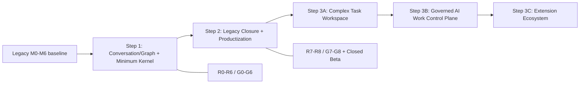

# Rhiza 三步走开发路线指南 v1.0

> **Superseded(2026-08-22)**:本文档已被《Rhiza 开发路线图 V4.0》取代;其中的 WP/R/G 编号体系已废止,当前开发只使用统一的 M01+ 编号。仅作 Historical Evidence 保留。现行基线:`docs/Rhiza_开发路线图_V4.0_20260822.md`。

> 文档状态：施工路线 / Delivery Roadmap（已废止）
> 日期：2026-08-18
> 适用范围：从 Legacy-M0..M6 基线迁移至 Phase 1 Productization，以及其后的长期产品演进
> 读者：产品、架构、工程、测试与运营负责人

---

## 0. 文档地位、使用方式与命名规则

本文件把 Rhiza 的战略目标转换成可以分批施工、验证和停止的开发路线。它不替代架构设计书中的数据模型、事务边界或 Gate；也不把尚未实现的目标架构写成当前事实。

文档之间的职责如下：

| 文档 | 负责的问题 | 本文件如何使用 |
| --- | --- | --- |
| [0815 三步走开发战略与架构重构规划](./0815Rhiza_三步走开发战略与架构重构规划_v2.3_高性能与跨平台优化.md) | Rhiza 为什么要从对话产品演进为复杂 Human–AI Work 的 Control Plane + Observability Plane | 作为产品方向、长期边界和阶段价值假设 |
| [0818 技术架构设计书](./0818Rhiza_技术架构设计书_v3.0_事件驱动工作图谱与可移植运行时.md) | Workspace Kernel 的不变量、R0–R8 迁移批次、G0–G8 Gate | 作为唯一的架构施工与验收基线 |
| [当前实现架构说明](./architecture.md) | 已部署 Legacy 实现及当前技术债 | 作为 R0 characterization 的比较对象，而非目标架构证明 |
| [Legacy M6 验收](./M6_ACCEPTANCE.md) | 已完成 UX 工程项与两项仍缺失的人工证据 | 保留为 Legacy 证据；不能替代 G0–G8 |

### 0.1 命名空间：不要混用编号

| 名称 | 含义 | 本文规则 |
| --- | --- | --- |
| `Legacy-M0..M6@2026-08-14` | 0815 前的产品/工程基线 | 只作为回归与迁移输入 |
| `P1-M0..M8` | 0815 的 Phase 1 产品里程碑 | 作为产品交付映射，不重定义 |
| `R0..R8` | 0818 的架构迁移批次 | 施工顺序与架构 Gate 的唯一正式编号 |
| `G0..G8` | 0818 的自动化/人工架构 Gate | 未通过即不可宣布对应迁移完成 |
| `WP-*` | 本文件的工作包（Work Package） | 仅便于排期、拆 ticket 和汇报；绝不替代 P/R/G |

本文建议“三步走”，但执行单位不是一个大而不可验收的 Step，而是以 `WP-*` 表示的纵向工作包。Phase 1 的每个工作包都必须映射到至少一个现有 R/G；Step 3 工作包必须在开工前通过 ADR 建立后继 Gate。所有工作包都必须具备目标、范围、依赖、验收、非目标、Evidence 与退出条件。

### 0.2 WP、架构批次与产品里程碑映射

| 本文工作包 | 架构迁移/Gate | 0815 产品里程碑 | 完成语义 |
| --- | --- | --- | --- |
| WP-1.0 | R0 / G0 | P1-M0 前置 characterization | 冻结 Legacy 行为、fixture、schema/API 与性能基线 |
| WP-1.1 | R1 / G1 | P1-M0；P1-M1 的 Identity/Scope 部分 | 建立边界、Identity、Resource 与 Host Port |
| WP-1.2 | R2 / G2 | P1-M1 | State + Journal + Receipt 可靠事实层 |
| WP-1.3 | R3 / G3 | P1-M3 | Conversation Runtime + ExecutionRun |
| WP-1.4 | R4 / G4 | P1-M2 | Universal Work Graph + Conversation Projection；施工顺序有意晚于 Run |
| WP-1.5 | R5 / G5 | P1-M4 | Context Runtime v1 |
| WP-1.6 | R6 / G6 | P1-M5 | Revision、Replay、Provenance、Bundle |
| WP-2.0 | R7 / G7 | P1-M6 的 Legacy closure | 关闭旧写路径并保留可验证回滚 |
| WP-2.1、WP-2.2 | R8 / G8 | P1-M6 | Productization 与九项兼容性 Spike |
| WP-2.3 | 不新增 R/G；必须先通过 G8 | P1-M7 | Closed Beta 产品假设验证 |
| WP-2.4 | 不新增 R/G；依赖 P1-M7 Go | P1-M8 | 只做 Beta 收口并冻结 Kernel v1 协议 |

`G8`、`P1-M7` 与 `P1-M8` 是三个不同完成面：G8 证明架构与产品化 Gate，P1-M7 证明真实用户价值，P1-M8 才代表 Beta 后协议收口。不得用其中任意一个代替另外两个。

### 0.3 总路线



---

## 1. 当前状态与路线起点

### 1.1 当前判断

当前仓库处于：

```text
Legacy M0-M6 engineering baseline completed in code
        +
Legacy M6 two manual evidence items pending
        ↓
R0 / G0 preparation — new architecture not yet implemented
```

当前已具备 Conversation、Branch/Graph、Context UI、Provider Runtime、JSON 默认持久化和 PostgreSQL migration baseline；细节见[当前实现架构说明](./architecture.md)。但它尚未具备 v3.0 要求的 Event Journal、ExecutionRun、通用增量 Graph Projection、不可变 Context Manifest、HostRuntimePort、可移植 Bundle 或新模块边界。

必须正视的语义缺口：当前 Graph 删除可能影响历史对象，Context Manifest 可更新，模型调用没有持久化 Run 身份，Graph/Planner 仍存在全量加载/扫描路径。这些是 Step 1 的改造对象，不是可以用 UI 补丁绕开的缺陷。

### 1.2 Legacy 证据的处理

Legacy M6 的自动化工程证据可以复用为 G0 的 Characterization 输入，但下列两项仍然未完成，且必须原样保留到 Step 2：

1. 100 Node 真实浏览器连续一小时稳定性测试。
2. 未接触 Rhiza 的真实用户可用性测试，以及 P0/P1 问题闭环。

详见 [M6_ACCEPTANCE.md](./M6_ACCEPTANCE.md)。在这两项补齐前，不得以“Legacy M6 已完成”替代“Phase 1 Productization 已完成”。

---

## 2. 全局 Definition of Done、Gate 与 Evidence 规则

### 2.1 每个工作包的 Definition of Done

除仅做 Spike 的工作包外，完成一个 `WP-*` 至少意味着：

1. **领域与契约**：Domain contract、Application Command/Query、错误分类与版本策略已明确。
2. **数据与迁移**：schema、forward migration、backfill/reconcile、rollback window 已实现并测试。
3. **产品纵切**：存在最小 API/Protocol 和可观察的 UI 或 CLI 路径；不能只落底层表。
4. **测试**：正常、失败、重试、取消、并发及回归路径覆盖；关键不变量应自动化。
5. **性能与故障**：符合该 WP 的量化阈值；列出 checkpoint、注入命令、恢复命令和 checksum。
6. **文档与证据**：ADR（如需要）、操作手册、Known Limitations 与机器可读 Gate evidence 完成。
7. **无旁路**：新代码不直接穿透 Domain/Application 写数据库、文件系统、Provider 或 OS。

### 2.2 Evidence manifest 最小字段

每个 G0–G8 必须保存一个机器可读 manifest 至 `docs/architecture-gates/`（目录由 WP-1.0 创建），并至少包括：

```text
gate_id
architecture_version
commit
fixture_id + fixture_digest
command
environment_profile
started_at + finished_at
result
checksums
absolute_metrics
regression_vs_g0
failure_injection_checkpoint
recovery_command
manual_evidence_links
known_exceptions + expiry
```

同一 fixture 的“连续执行一致”只允许 timestamp、process/host ID 与明确声明的非确定性 telemetry 变化；canonical artifact checksum 必须相同。任何例外必须有负责人、过期日期和 ADR/issue 链接。

### 2.3 硬性架构规则

- 采用 **Current State + Append-only Domain Journal**；不在 Phase 1 建设完整 Event Sourcing 或 CQRS 平台。
- Domain Event、Execution Trace、Transient Stream 三者物理路径和 retention 分离。
- Graph 是可重建 Projection；布局不是业务真相；删除视图对象不得级联抹除历史事实。
- Context Manifest 是已执行输入的不可变证据；历史回放不重新执行当前 Planner。
- 外部效果必须先有 `ExecutionRun`，并通过 Lease/Fencing 支持恢复和防旧写。
- Core 必须 Headless；OS/文件/网络特性经由 Host Runtime Port 注入。
- Bundle 是版本化逻辑迁移格式，不能用数据库 dump 冒充用户可移植性。
- Phase 1 默认模块化单体 + 一个 PostgreSQL 实例；明确不引入 Kafka、微服务、公共 Marketplace、通用 Agent 编排引擎或自有 Code Harness。

### 2.4 阶段度量面板

| 类别 | 必报指标 | 判断规则 |
| --- | --- | --- |
| 正确性 | event 缺失、checksum mismatch、dangling ref、duplicate effect | 任一 Gate 的目标值通常为 0 |
| 性能 | command/query p95/p99、Graph/Context p95、相对 G0 回归 | 同时报绝对阈值与相对 G0；不只报告平均值 |
| 恢复性 | checkpoint 恢复成功率、silent fallback、stale write | 安全关键路径为 100% 拒绝或 0 误写 |
| 可移植性 | bundle round-trip、secret/path leakage、跨 Host contract | 逻辑 identity/provenance 必须一致 |
| UX | 核心任务完成率、P0/P1、跨会话继续率 | 真实用户证据不能用内部演示替代 |
| 架构纪律 | dependency violation、全量扫描、legacy write | 目标为 0，除非 Gate 明确豁免 |

---

# Step 1：Conversation & Graph 完备化 + 最小 Workspace Kernel

## 3. Step 1 定义

**阶段目标**：将 Conversation 作为第一条完整业务纵切，而不是作为未来 Kernel 的例外。交付可长期内部使用的 Conversation Kernel Alpha：用户能完成对话、分支、编辑重发、重新生成、Graph 浏览、显式 Context、故障恢复、历史 Replay 与跨机器 Bundle；所有关键结果均可追溯、重建和迁移。

**对应架构批次**：`R0 → R1 → R2 → R3 → R4 → R5 → R6`，只有 `G0..G6` 全绿才算 Step 1 完成。

**阶段明确不做**：完整 Task 产品、Adaptive Router scoring engine、Multi-Agent Coordinator、Public Extension SDK/Marketplace、跨 Workspace Mission、微服务/Kafka、CRDT、自治 Agent scheduler。可以为它们预留 contract seam，但不能提前将其实现为产品。

## 4. WP-1.0：冻结 Legacy、建立可比较基线

**映射**：`R0 / G0`；产品映射：P1 前置准备。

### 目标

将当前行为变成可重复验证的迁移输入，使后续重构的每项语义变化都是有意且可审计的。

### 范围与交付

- 为设计书指定的 Legacy 基线建立正式 git tag（须由发布负责人在确认 commit 后执行）。
- API、schema、fixture 的版本化 snapshot 与 checksum。
- 脱敏 fixtures：空 Workspace、小型分支、含 Graph/Context/Provider 的典型 Workspace、错误/取消/恢复样本。
- Characterization：chat、branch、edit/resend、regenerate、Stop/error/retry、file、archive/restore、merge/delete、provider selection。
- 固定 runner、环境画像、数据规模与当前性能基线。
- `docs/architecture-gates/G0.*` evidence 与 Legacy M6 人工缺口登记。

### 前置依赖

- 当前测试、构建和 M6 自动化可运行。
- 已确认 fixture 中没有 API key、用户文件原文或本机绝对路径。

### 验收条件

- Characterization 自动化通过率为 **100%**。
- API、schema、fixture 都有不可变版本号和稳定 checksum。
- 同一 fixture 连续执行的 canonical checksum 一致。
- G0 对每个基线性能指标记录 p50/p95/p99 与环境画像。
- [M6 验收](./M6_ACCEPTANCE.md)中两项人工缺口在 G0 evidence 中标为 `pending`，而非删除或视作通过。
- 不属于 Kernel/回归/迁移的功能开发冻结；例外必须有 ADR。

### 明确不做

- 不修改 Domain 模型，不改变用户语义，不开始双写。
- 不用手工截图或“开发者主观判断”替代可重复 characterization。

## 5. WP-1.1：模块边界、Identity、Resource 与 Host Port

**映射**：`R1 / G1`；产品映射：P1 Kernel foundation。

### 目标

建立可被 Conversation、未来 Task、Artifact、Execution 与 Extension 共同使用的最小 Kernel 边界；让基础设施能力不能直接污染领域语义。

### 范围与交付

- 定义 `domain`、`application`、`contracts`、`infrastructure-*`、`runtime-adapters`、`web` 的依赖规则。
- Application Command/Query、Unit of Work、错误 taxonomy 和 compatibility facade。
- `ObjectRef`、`ExternalRef`、`ActorRef`、`ScopeRef`；确定逻辑 identity 不使用文件路径或数据库 row id。
- `Resource`、不可变 `ResourceVersion`、content digest 与 Blob promote/commit protocol。
- `HostRuntimePort`，以及 Windows/macOS/Linux/headless capability Fake descriptor。
- Legacy ID deterministic backfill 与 dangling-reference scanner。

### 前置依赖

- WP-1.0 通过，且 baseline fixture 能在新测试 harness 运行。
- 关键跨层决定（包边界、identity、blob 生命周期）先写 ADR。

### 验收条件

- package dependency violation = **0**。
- Domain/Application 中 OS-specific import = **0**；React、Express、具体模型 SDK 不进入 Domain。
- Windows/macOS/Linux/headless Fake contract = **4/4**。
- ID backfill dangling refs = **0**；重复运行 backfill checksum 不变。
- 在 temp、promote、verify、DB-commit 各 checkpoint 注入故障后，committed dangling blob refs = **0**。
- 全部 Legacy characterization 路径无回归。

### 明确不做

- 不拆微服务，不替换为多数据库，不引入真实跨平台桌面壳。
- 不为每类未来对象复制一份独立 identity 系统。

## 6. WP-1.2：Transactional State + Domain Journal Shadow

**映射**：`R2 / G2`；产品映射：P1 Conversation history foundation。

### 目标

让关键行为同时留下当前状态和可排序、可重放的业务事实；Journal 用于追溯与重建，不承载 token/trace 等高频数据。

### 范围与交付

- versioned Event Envelope、事件 catalog、workspace sequence。
- `workspace_events`、`CommandReceipt`，State + Event + Receipt 同事务。
- append-only 数据库保护与 command idempotency。
- shadow dual-write、历史 backfill/reconcile、兼容 snapshot + tail replay。
- 事件分类文档：语义 Domain Event、Trace、Transient Stream 的边界。

### 前置依赖

- WP-1.1 的 UoW/identity/边界测试通过。
- 先确认 Journal retention、event schema 演进和序列分配 ADR。

### 验收条件

- Characterization 关键路径 missing semantic event = **0**。
- 同一 command 重放 **100 次**，新增 event = **0**。
- 在 State、Event、Receipt 三处分别注入故障，half commit = **0**。
- 同一 Workspace **100 并发 command** 下 duplicate/out-of-order sequence = **0**。
- Backfill 重跑 checksum 一致；任意兼容 snapshot + tail replay 的 state/projection checksum 与 current 一致。
- token、stdout、文件读取等高频记录进入 Domain Journal 的数量 = **0**。

### 明确不做

- 不将所有表改造成纯 Event Sourcing。
- 不向用户暴露未稳定的原始事件浏览器作为产品功能。

## 7. WP-1.3：持久化 Conversation Execution Runtime

**映射**：`R3 / G3`；产品映射：P1 Conversation Runtime。

### 目标

所有模型调用都先成为有稳定身份的 `ExecutionRun`，之后才可 dispatch 外部效果。成功、失败、超时、取消、崩溃和重试在用户与系统层面都可解释。

### 范围与交付

- `ExecutionRun` 状态机、`DispatchAttempt`、Lease/Fencing、RunGroup 基础契约。
- `ModelSpec`、`ProviderEndpoint`、`ContextEnvelope v0` 版本化快照。
- RuntimeAdapter、TraceSink、StreamSink、batch/backpressure 和 crash reconciliation。
- Stop、Retry、Regenerate 的稳定语义；用户能在 Conversation UI 看到 run 状态、错误分类及恢复入口。
- TTFT、总耗时、token、错误类型、Endpoint telemetry。

### 前置依赖

- WP-1.2 的 CommandReceipt 和 Journal 已可用于 run 生命周期。
- ProviderRuntime 的现有 SSE 契约已被 characterization 覆盖。

### 验收条件

- 外部调用 Run terminal tracking = **100%**。
- Fake side-effect Runtime 在 dispatch、ack、terminal 三个崩溃点恢复后 duplicate effect = **0**。
- stale lease epoch terminal write accepted = **0**。
- `cancel_requested` 与 late result 竞态分类覆盖 = **100%**；created/dispatching/running 三阶段 Stop 均不产生未授权后续 Effect。
- 多 attempt trace `(run, epoch, sequence)` 冲突/覆盖 = **0**，stale trace 不进入默认结果。
- 在 **10,000 trace records/run** 下 lifecycle Domain Event ≤ **10/run**，nominal load trace drop = **0**。
- Trace flood 下基础 command/query p95 相对 G0 退化 ≤ **25%**，且 Domain Event 因 backpressure 丢失 = **0**。

### 明确不做

- 不实现自治 Agent loop、跨 Provider 智能路由或多 Agent 调度。
- 不把 token stream 直接写入业务事务或 Domain Journal。

## 8. WP-1.4：完备 Conversation 与 Universal Work Graph v0

**映射**：`R4 / G4`；产品映射：P1 Conversation/Graph。

### 目标

交付用户可依赖的 Conversation 主循环，并把 Graph 转为通用、增量、可重建 Projection。Conversation 是第一个 object family，不是 Graph Kernel 的唯一假设。

### 范围与交付

Conversation 路径：创建、重命名、归档/恢复、节点多轮对话、Branch、Merge、Edit & Resend revision、Regenerate 新 Run、Stop/error/retry、显式 Context、文件、Provider/Model 选择、刷新/跨会话恢复。

Graph 路径：universal object refs、语义 relation、layout 与 relation 分离、incremental projector、clean rebuild、neighborhood/depth query、Tree/Chat/Graph 的共享活动对象、archive/tombstone 默认删除语义。

### 前置依赖

- WP-1.3 ExecutionRun 和基础 trace/stream 已上线。
- 旧/新 Graph semantics 和 layout 的 diff fixture 已由 WP-1.0 固定。

### 验收条件

- Conversation characterization = **100%**；Edit、Regenerate、Branch 均不会覆盖旧历史。
- 删除 Graph node 导致 Domain Object 物理删除的次数 = **0**。
- old/new Graph semantic diff = **0**；clean rebuild checksum 一致。
- 在 **10k objects / 50k edges**、1-hop、limit 200 条件下：p95 ≤ **150ms**，p99 ≤ **400ms**。
- 单次 Graph API 返回 nodes ≤ **500**。
- Domain write 等待 layout/cluster worker 次数 = **0**。
- 新增 Task/Artifact object type 的 contract test 不需修改 Graph Kernel。

### 明确不做

- 不建设完整 Task board、Knowledge Graph 或图自动聚类产品。
- 不让布局、颜色、坐标成为业务事实；不以 cascade delete 清理历史。

## 9. WP-1.5：Context Runtime v1

**映射**：`R5 / G5`；产品映射：P1 Explicit Context。

### 目标

把 Context Panel/Planner 从 Conversation 附属 UI 变为独立 Runtime：选择可解释，执行输入不可变，历史可解析，主路径不扫描整个 Workspace。

### 范围与交付

- Resource materialization、Candidate Index、Contributor、Planner、Compiler 分层。
- `ContextManifest v1`：Active/Recommended/Excluded、选择/排除理由、ResourceVersion/digest、scope、预算、planner/compiler/cache version。
- Auto/Assisted/Strict 控制模式、immutable DB protection、historical resource resolution。
- UI 可解释每一项为何被选择或排除，并能从已执行消息回到对应 Manifest。

### 前置依赖

- WP-1.1 ResourceVersion、WP-1.2 事件和 WP-1.4 Graph query contract 已稳定。
- Context 缓存键和 materialization 生命周期有 ADR。

### 验收条件

- 常规 Planner full Workspace scan = **0**。
- candidate/context lookup p95 ≤ **250ms**。
- 已执行 Manifest 成功修改次数 = **0**。
- materialization cache 只由 ResourceVersion/hash + index version 驱动；Planner/Compiler cache key 覆盖 input、selection、graph、scope、component versions。
- historical Manifest resolve = **100%**，且 Replay 不重新运行当前 Planner。
- Manifest source 100% 关联实际 ResourceVersion 与 digest；UI 能展示选择/排除原因。

### 明确不做

- 不做全 Workspace 自动记忆注入。
- 不把“当前推荐”回写为过去已执行的 Manifest。

## 10. WP-1.6：Revision、Replay、Provenance 与 Portable Bundle

**映射**：`R6 / G6`；产品映射：P1 portability/reliability。

### 目标

完成用户对历史和数据的所有权：结论能回到输入、Context、Run、模型与 Endpoint；Workspace 可安全地导出、导入和迁移。

### 范围与交付

- Revision、Branch、Replay stable API；Exact/Partial/Current-model Replay 分类。
- `ProvenanceLink`、tombstone、Purge policy 与审计视图。
- `workspace.rhiza` ZIP logical bundle、content-addressed blob、descriptor、export/import、clean-store round-trip。
- 导出元数据过滤，导入 Zip Slip/symlink/重复条目/zip bomb/quota 防护，中断恢复。

### 前置依赖

- WP-1.2 Journal、WP-1.3 Run snapshot、WP-1.4 Projection、WP-1.5 Manifest 已可稳定解析。
- 明确 Purge、secret/export policy 与 bundle format version ADR。

### 验收条件

- AI output → input/manifest/run/model/endpoint provenance = **100%**。
- Replay 分类覆盖 = **100%**；ResourceVersion 缺失时 silent fallback = **0**。
- Bundle dangling refs = **0**；runtime snapshot/model spec/endpoint descriptor/context envelope resolve = **100%**。
- 默认 Export 的 location metadata/secret 扫描泄露数 = **0**。
- Blob promote/commit/read 故障后 silent fallback = **0**。
- Zip Slip、symlink、duplicate/undeclared entry、zip bomb、entry/total/quota 超限拒绝率 = **100%**。
- export → clean store → import 后 identity/provenance/graph/context checksum mismatch = **0**，核心 Conversation 路径全通过。
- path 或 DB row id 参与 logical identity = **0**。

### 明确不做

- 不承诺 OCI runtime 兼容，不用数据库 dump 作为 Portable Bundle。
- 不在 Phase 1 实现跨设备实时同步或端到端共享协作。

## 11. Step 1 Exit Gate

仅当以下条件同时成立，才能进入 Step 2：

- `G0..G6` 全绿，Evidence manifest 可复跑、可定位 commit 与 fixture。
- Conversation → Branch → Graph → Context → Run → Replay → Bundle 的主闭环无回归。
- 新数据可 replay、rebuild、export/import；Graph/Context 不依赖全 Workspace snapshot 扫描。
- 内部 dogfood 已覆盖至少一个跨多会话的真实复杂项目，并记录问题与修复状态。
- Legacy 仍可通过 facade 回滚，但不再增加任何 Legacy-only 语义。

---

# Step 2：Legacy 收口、产品化与 Closed Beta

## 12. Step 2 定义

**阶段目标**：证明新 Kernel 不仅能跑通演示，还能安全取代 Legacy、承受真实负载、在真实用户任务中被理解和继续使用。Step 2 结束时，Phase 1 才能宣布 Productization 完成。

**对应架构批次**：`R7 / G7`、`R8 / G8`，加 Closed Beta 和内部协议冻结。

**阶段明确不做**：为“看起来更完整”而提前做完整 Task/Agent/Marketplace 产品；R8 的九项内容是兼容性 Spike，必须证明 seam 可扩展，不是授权把长期功能一次性全部上线。

## 13. WP-2.0：Legacy Closure 与可回滚迁移

**映射**：`R7 / G7`；产品映射：P1 migration closure。

### 目标

将所有读写经由 Application facade 与新 Kernel，关闭旧事实源，且保留有界、经验证的回滚窗口。

### 范围与交付

- legacy write logging/assertion 和 dashboards。
- 旧 API 全部转换至 Application facade；bundle import、projector、recovery 全部只走新边界。
- expand/contract migration、reconciliation、rollback runbook 和数据保留窗口。
- 禁止 mutable Manifest/Message upsert、`deleteMissing` 与历史 cascade delete。

### 前置依赖

- Step 1 Exit Gate 全部通过。
- staging 使用可代表生产规模的脱敏数据及 migration checkpoint 清单。

### 验收条件

- staging 连续 **24 小时** legacy write count = **0**。
- reconciliation mismatch = **0**。
- rollback 后新的 Journal/Bundle 数据仍可读，且核心路径可执行。
- mutable Manifest/Message upsert 和 `deleteMissing` 历史删除路径 = **0**。
- 每个 migration checkpoint 的故障注入可恢复，恢复后 checksum 与预期一致。

### 明确不做

- 不立即删除旧表/旧数据；删除属于独立、经审批的后续保留策略。
- 不通过双写长期共存回避收口决策。

## 14. WP-2.1：可靠性、性能与 UX Hardening

**映射**：`R8 / G8` 的产品化轨道；产品映射：P1 UX/operability。

### 目标

把 Kernel 的正确性转化为用户可感知的稳定性：慢、离线、失败、取消、恢复、导入导出和大 Workspace 均有明确且可验证的体验。

### 范围与交付

- 发布前 command/query/Graph/Context 性能 suite 与预算监控。
- loading/empty/error/offline/reconnect/retry/cancel 的一致 UI 与可访问性验证。
- 100 Node 一小时真实浏览器稳定性运行手册及记录。
- backup/restore、export/import、migration rollback 演练；Known Limitations、恢复/排障文档。

### 前置依赖

- WP-2.0 已关闭 Legacy 写路径。
- G0 性能基线和 G3/G4/G5/G6 负载 fixture 可复跑。

### 验收条件

- 主 Command（不含外部等待）p95 ≤ **200ms**、p99 ≤ **500ms**；同 fixture 相对 G0 p95 回归 ≤ **25%**。
- 100 Node 生产构建连续使用 **1 小时**；warm-up 后 retained heap、DOM node、listener 不持续单调增长，并保存起止数据与操作记录。
- Offline、Reconnect、Retry、Loading、Empty、Error 均有恢复路径与自动化覆盖。
- export/import、backup/restore、migration rollback 各完成至少 **1 次** 演练。
- 旧 M6 两项人工验收的稳定性部分完成并归档真实证据。

### 明确不做

- 不以平均响应时间掩盖 p95/p99。
- 不将性能不达标归因为“模型慢”而忽略本地 command/query 路径。

## 15. WP-2.2：九项兼容性 Spike

**映射**：`R8 / G8` 的架构兼容性轨道；产品映射：P1 future seams。

### 目标

以小而固定的输入证明 Kernel 可承载下一阶段对象和执行方式；每项 Spike 只验证 contract，不扩展为完整产品项目。

### 范围与验收

| Spike | 固定输入/目标 | 必须通过的验收 |
| --- | --- | --- |
| Task | Task + Conversation + Artifact fixture | 只增加 object/relation type，不改 Graph Kernel；关系可重建 |
| External Agent Run | 20 trace + artifact + effect | Run identity/lifecycle/event contract 不变；外部 effect 可追溯 |
| Extension | contributor + subscriber + namespaced storage | Scope/Resource/Event seam 足够；extension 无法绕过 scope |
| Adaptive Router | 2 个同名模型 Endpoint + 1 个不同模型 | telemetry/score 按 Endpoint 隔离；manual fallback 可用 |
| Multi-Agent | A/B 并行、C 等待、共享 RunGroup | 独立 Run/Manifest；handoff、cancel、conflict 可解释 |
| Trace Flood | 1 Run + 10k records | batch/backpressure 生效；Domain Event ≤ 10/run |
| Host Adapter | 4 capability descriptors | 同一 Core 用例 4/4；缺 capability 给出稳定原因 |
| Portable Bundle | export → clean store → import | identity/provenance/ref checksum 一致 |
| Large Graph | 10k objects + 50k edges | neighborhood query 有界；不返回全图 |

### 前置依赖

- WP-2.0 完成；每个 Spike 在实现前登记 fixture digest、执行命令、预期 artifact/checksum、失败分类。

### 总体验收条件

- Spike contract tests = **9/9**。
- Large Workspace：**10k objects、50k edges、1k resources、100 runs**。
- Trace Flood：**10k records/run**、Domain Event ≤ **10/run**、主路径 p95 回归 ≤ **25%**。
- Multi-Agent：**20 concurrent Runs**，Task transition raw-trace scan = **0**。
- Platform contract = **4/4**。
- Bundle round-trip dangling refs/identity mismatch = **0**。
- staging migration 连续执行 **3 次** 结果一致；所有 checkpoint 注入故障可恢复。
- Legacy UX characterization 全通过。

### 明确不做

- 不把 Spike 代码无审查地提升为公开产品 API。
- 不在此阶段推出生产 Multi-Agent、公共扩展市场或自适应路由产品。

## 16. WP-2.3：Closed Beta 产品假设验证

**映射**：不新增 R/G，必须先通过 `G8`；产品映射：`P1-M7`。

### 目标

验证用户是否真实需要并能独立使用 Graph、Branch、显式 Context、可追溯历史和可移植 Workspace，并用预先冻结的 Go/No-Go 门槛决定是否进入协议收口。

### 范围与交付

- 招募 8–15 名目标用户，至少取得 **8 份有效样本**；观察期为 **3–4 周**，每人使用一个跨多次会话的真实复杂项目。
- 预先冻结五项核心任务：创建/恢复 Workspace、建立 Branch、从 Graph 回访、调整 Context、检查 Provenance/Replay。
- 预先冻结 P0/P1 分类、Go/No-Go 阈值和无效样本判定；测试开始后不得根据结果事后放宽。
- 行为指标：branch usage、graph revisit、context selection/exclusion、replay、cross-session continuation、user-created structure、long-project retention。
- Beta evidence：研究任务、脱敏行为数据、访谈记录、P0/P1 清单、Go/No-Go 决策和后续结构性问题列表。

### 前置依赖

- WP-2.1 和 WP-2.2 全部通过；Known Limitations 与数据恢复流程已对测试者透明。
- 参与者同意、数据处理与支持响应流程已准备。

### 验收条件

- 有效样本数 ≥ **8**，少于 8 直接判定证据不足、不得 Go。
- 五项核心任务在不发生研究员接管的情况下，按全部有效用户和任务合计的完成率 ≥ **80%**。
- 有效用户中，≥ **60%** 在至少两个不同自然日继续同一 Workspace。
- 有效用户中，≥ **50%** 在真实任务里使用 Branch、Graph revisit、Context adjustment、Replay 中至少两类差异化行为。
- Beta 报告必须包含上述行为指标及分母、无效样本原因和定性反馈，不得只报消息数或注册量。
- P0 = **0**；阻断发布的 P1 = **0**，其余 P1 有明确负责人、版本和截止时间。
- 任一数值门槛未通过即为 **No-Go**：回到 WP-2.1 或调整产品范围，修复后重新运行 Beta；不得用解释性结论、内部投票或事后修改阈值替代复测。

### 明确不做

- 不将 Beta 用户增长、聊天条数或内部正反馈视为产品验证。
- 不在 Beta Go 前冻结错误抽象，也不承诺公开 SDK 或长期兼容性 SLA。

## 17. WP-2.4：Phase 1 Consolidation 与协议冻结

**映射**：不新增 R/G；产品映射：`P1-M8`。

### 目标

只修复 P1-M7 暴露的结构性问题，冻结 Kernel v1 内部协议，使 Step 3 只能通过稳定 Application/Protocol seam 演进。

### 范围与交付

- Beta 结构性问题的修复与回归，不再扩张 Phase 1 产品范围。
- Event v1、Work Graph v1、Context Manifest v1、ExecutionRun v1、Workspace API/Protocol v1。
- breaking change、deprecation、migration 和兼容窗口策略。
- Kernel v1 contract fixture、version matrix 与 clean-store migration evidence。

### 前置依赖

- WP-2.3 已获得 Go；P0 = 0，阻断发布的 P1 = 0。
- 所有准备冻结的协议已有真实 Beta 路径和稳定 contract test。

### 验收条件

- Event/Graph/Manifest/Run/Workspace Protocol v1 contract test 全绿。
- 支持版本矩阵中的 upgrade、rollback、Bundle import/export migration test 全绿。
- 新功能绕过 Application/Protocol seam = **0**。
- 所有 Beta 结构性问题都有“已修复/明确延后/缩减范围”决策与负责人。
- P1-M8 evidence 独立于 G8 和 P1-M7 保存，三者不得合并为一条完成记录。

### 明确不做

- 不在收口期增加 Task、Agent、Router 或公开 Extension 产品。
- 不为了冻结版本而掩盖已知不稳定契约；不满足条件则继续保持 pre-v1。

## 18. Step 2 Exit Gate：Phase 1 Productization

只有以下全部满足，才能宣布 Phase 1 Productization 完成：

- `G7`、`G8` 全绿；R0–R8 的 evidence 链完整。
- Legacy write 已连续 24h 为 0，回滚演练可读新 Journal/Bundle。
- 九项 Spike 为 9/9；性能、Trace、Large Graph、Host、Bundle、migration 量化阈值全达标。
- 100 Node 一小时稳定性与真实用户可用性两项 Legacy M6 人工证据真实完成。
- P1-M7 Closed Beta 达到本文冻结的 Go 门槛，P0/P1 闭环。
- P1-M8 consolidation 完成，Kernel v1 协议冻结，下一阶段只能经 contract seam 演进。

---

# Step 3：长期产品开发目标

## 19. Step 3 执行原则

Step 3 是一组受用户证据驱动的长期阶段，不是预先承诺的巨大 backlog。每个里程碑结束时，产品负责人必须基于使用数据决定：继续、调整、延后，或停止下一层扩张。下列 WP 不映射到新的官方 R/G 编号；其架构变更应在开始时新建 ADR 与对应 Gate，而非复用已关闭的 G8。

### 19.1 Step 3 Future Gate 与 Evidence 合同

本文以 `FG-WP-*` 表示规划中的 Future Gate 占位符，它不是已经批准的正式 Gate。每个 Step 3 工作包开工前必须通过 ADR：确认正式 Gate ID、owner、fixture、性能/安全阈值、失败分类和 evidence 路径；没有这些内容，只能做探索性 Spike，不能宣布工作包完成。

每个 Future Gate 至少保存：

```text
future_gate_id + wp_id
adr_refs + contract_versions
fixture_id + fixture_digest
command + environment_profile
functional_checksums + performance_metrics
permission/threat-model cases
failure_injection + recovery evidence
migration/rollback evidence
manual product evidence
result + owner + approved_at
```

不同阶段还必须补充：

- Step 3A：对象/关系 checksum、TaskPlan revision、跨对象 dangling refs、并发 Workstream、真实 Complex Work Beta。
- Step 3B：权限负例、Lease 撤销/过期、Agent 扩权攻击、沙箱逃逸尝试、冲突恢复、人工降级。
- Step 3C：恶意/损坏包、签名与来源校验、权限 diff、升级/卸载/撤回/离线 Registry 和数据导出恢复。

下文每个 WP 的“验收”即其单项退出条件；对应 `FG-WP-*` evidence 未生成或未通过时，该 WP 状态不得标记为完成。

## 20. Step 3A：Complex Task Workspace

### WP-3A.0：Kernel Convergence

**目标**：根据 Beta 与运维数据确认 Kernel v1 的真实边界，清理临时 compatibility seam，建立 Phase 2 benchmark。

**交付与依赖**：依赖 Step 2 Exit；完成 Kernel ADR v1、跨模块耦合清单、Workspace benchmark、兼容/弃用计划。

**验收**：新功能绕过 contract = 0；所有耦合项有“保留/迁移/删除”决策；基准可复跑；无未归档的 Phase 1 临时例外。

**不做**：不在清理期顺带改写稳定协议或推出新对象类型。

### WP-3A.1：Resource、Artifact、Knowledge

**目标**：让 Context 的输入从 Message 扩展到可版本化的通用资源与产物。

**交付与依赖**：依赖 WP-3A.0；Resource/Artifact/Knowledge object types、version/hash/provenance、引用 API 与基础 View。

**验收**：每个 Artifact 可被 Conversation、Task、Run 引用；创建、更新、tombstone 均有 Event；历史 Context 可解析到正确版本；跨对象引用 dangling = 0。

**不做**：不建设全文企业知识库或隐式抓取所有本地文件。

### WP-3A.2：Goal、Task、Workstream

**目标**：把“要完成什么、谁依赖谁、何时阻塞”变为 Workspace 一等事实。

**交付与依赖**：依赖 WP-3A.1；Goal/Task/Workstream、versioned TaskPlan、`blocked_by/depends_on` relation、Task Graph View。

**验收**：Task 不依赖 Conversation 存在；TaskPlan 版本化；依赖环检测和阻塞解释可用；Task View 由通用 Graph Projection 生成；Task state 改变不扫描 raw trace。

**不做**：不复制完整项目管理套件，不做自治排程。

### WP-3A.3：Context v2 与 Multi-view Graph

**目标**：支持针对任务、知识、决策、执行的可审阅上下文，且一个事实模型投影多个 View。

**交付与依赖**：依赖 WP-3A.2；Task/Knowledge/Decision/Execution View、跨对象搜索、Context Packet preflight。

**验收**：用户可在执行前审视 Context；每个 View 可追溯同一 ObjectRef/Relation；Planner 不全量注入 Memory；不同 View 对同一关系的解释一致。

**不做**：不将 AI 自动总结当作唯一事实或自动修改 Task 状态。

### WP-3A.4：Routing 与 Execution Federation

**目标**：统一 LLM、Tool、CLI、External Agent 的调用边界，而不接管它们内部执行策略。

**交付与依赖**：依赖 WP-3A.3；Endpoint identity/telemetry、RoutingDecision、scoped Task Packet、External Runtime adapters。

**验收**：Provider 仅获得授权 Scope；RoutingDecision 不可变且可审计；失败不破坏 Workspace；同名模型不同 Endpoint 指标隔离；用户可手动降级/回退。

**不做**：不构建 Rhiza 自有 code harness 或完全自治 router。

### WP-3A.5：Assisted Multi-Executor

**目标**：让人、CLI 与 Agent 在明确授权下处理可并行的 Workstream。

**交付与依赖**：依赖 WP-3A.4；Assignment、授权 Context、Permission、pause/cancel、conflict detection/reconciliation。

**验收**：至少 3 Workstream、2 Executor 并行；每个 executor 有独立 Assignment/Context/Permission；可单独 pause/cancel；冲突有检测和人工 reconciliation；所有 Effect 可回到授权 Task。

**不做**：不默认允许 Agent 自行扩权、创建不可见任务或提交高风险操作。

### WP-3A.6：Observability、Extension SDK 与 Complex Work Beta

**目标**：让高密度执行对用户可理解，并以受控扩展和真实复杂任务验证 Task Workspace。

**交付与依赖**：依赖 WP-3A.5；Task→Run→trace 下钻、两个 first-party extension、两个 CLI adapter、内部 SDK version policy、Complex Work Beta。

**验收**：100+ tool events 可压缩浏览且保留证据；AI summary 是 Projection 不是事实源；extension 无法绕过 Scope；用户连续数周使用 Task、Conversation、Artifact、Context 和至少一种 external execution，且不退回“所有事情塞进聊天记录”。

**不做**：不开放公共 Registry，不以摘要替代 Effect/Trace 原始证据。

## 21. Step 3B：Governed AI Work Control Plane

| 工作包 | 目标与范围 | 前置依赖 | 验收条件 | 明确不做 |
| --- | --- | --- | --- | --- |
| WP-3B.0 Public Extension Platform | 稳定 extension manifest、permission、storage、UI surface、签名/校验 | Step 3A 内部 SDK 已经过 Complex Work Beta | 兼容测试通过；包可签名校验；权限变化可见；extension crash 不拖垮 Workspace | 不让 extension 直写 Kernel 表 |
| WP-3B.1 Extension Validation | 建立 install/upgrade 前独立验证 | WP-3B.0 manifest、权限和版本模型稳定 | schema、contract、permission、sandbox、migration、UI smoke 全通过才可安装；upgrade/rollback 不丢数据 | 不允许开发工具自我认证 |
| WP-3B.2 External Agent + Lease | 接入主动 Agent，同时保留人工边界 | WP-3A.5 Assignment/Permission 与 WP-3B.1 验证管线 | Agent 仅执行授权 Task；Lease 可撤销/过期停止；高风险动作需 approval；不可扩权 | 不做无审批自治代理 |
| WP-3B.3 Orchestration v2 | 动态协调多 Executor | WP-3B.2 证明受控 agent lifecycle | ≥3 executor 可协调；失败可解释 retry/reassign；冲突进入 reconciliation；支持 Manual/Assisted 降级 | 不承诺完全自动项目管理 |
| WP-3B.4 Cross-Workspace Mission | 协调多个 Workspace 而不复制事实 | WP-3B.3 中的 Assignment、Scope 与审计协议稳定 | Mission 可引用 ≥2 Workspace；不突破各 Workspace 权限；Context Packet 可审计 | 不合并各 Workspace 的权限与事实源 |
| WP-3B.5 Personal Routing Intelligence | 从真实 Endpoint 表现形成用户可控的能力画像 | WP-3A.4 已积累可信 Endpoint telemetry | score 含 confidence/sample/window；按任务条件区分；可关闭学习、清除历史、退回静态策略 | 不以黑箱分数强制替换用户选择 |
| WP-3B.6 Impact Graph + Automation | 可理解影响与受控长期自动化 | WP-3B.3 orchestration 与 WP-3B.5 routing 的审计链完整 | 100+ event 可压缩；每个 Impact 有 evidence；推断/已发生明确区分；automation 每次触发产生 Run 且可暂停停止 | 不给自动化隐式权限 |

Step 3B Exit：公开/外部执行能力均有版本、授权、审计、撤销、故障隔离与人工降级；没有任何 Agent/Extension 能绕过 Workspace Scope 与 Approval Policy。

## 22. Step 3C：Extension Registry 与生态

### 目标

在 Kernel 和公共 extension contract 经真实使用稳定后，建设可治理的生态层：发现、签名、版本锁定、权限、撤回、数据处置和第三方 Provider/UI Surface。

### 建议工作包与验收

| 工作包 | 目标与范围 | 前置依赖 | 验收条件 | 明确不做 |
| --- | --- | --- | --- | --- |
| WP-3C.0 Registry Governance | 定义发布者、签名、审核、撤回与兼容政策 | WP-3B.0–3B.1 的 extension contract 与验证机制稳定 | 每个 package 有发布者 identity、签名、版本、权限声明和兼容范围；撤回可执行且保留审计 | 不在没有发布者问责/撤回能力时开放上传 |
| WP-3C.1 Install Lifecycle | 安全安装、升级、停用、卸载 | WP-3C.0 治理政策与 package metadata | 安装/升级前展示权限 diff；Workspace 可 pin 版本；uninstall 支持 keep/export/delete 数据；失败可 rollback | 不将卸载等同于未经确认的数据物理删除 |
| WP-3C.2 Third-party Surfaces | 受控接入 Provider、Contributor、UI surface | WP-3C.1 生命周期、WP-3B.1 沙箱/验证 | 通过 contract/permission/sandbox 测试；crash 隔离；不得修改 Kernel Policy | 不授予第三方绕过 Scope/Approval 的特权 |
| WP-3C.3 Ecosystem Exit | 验证市场不是 Kernel 运行时强依赖 | 至少一个独立第三方 extension 经完整生命周期验证 | Registry 不可用时已安装 extension 按策略运行/禁用；恶意/损坏版本可撤回；用户数据可导出 | 不将 Registry 可用性设为打开既有 Workspace 的前提 |

### 明确不做

- 不在 Registry 成熟前绑定单一商业分发模型。
- 不让 Marketplace 成为打开既有 Workspace 或迁移数据的必需依赖。

---

## 23. 关键并行关系与不可并行边界

### 23.1 可提前准备、但不能提前宣布完成

| 并行准备 | 可从何时开始 | 完成依赖/限制 |
| --- | --- | --- |
| UX characterization 与 G0 runner | 立即 | 必须在 R0 冻结前不改变语义 |
| Context Index fixture、Bundle 安全测试、Host fake | G0 后 | 可做 fixture/contract Spike，但依赖 R1/R2 才能并入主线 |
| ExecutionRun 与 Graph projector 的实现准备 | G2 contract 稳定后 | 可并行；不能绕过 Journal/identity/UoW |
| 性能、故障注入、Evidence manifest 工具 | 从 G0 起持续 | 每个 R/G 必须使用同一证据格式 |
| Closed Beta 招募、研究任务设计 | G5 后 | 不在 G8 未达最低稳定性前将测试者置于迁移风险 |

### 23.2 硬依赖

```text
G0 → G1 → G2 → G3 → G4 → G5 → G6 → G7 → G8
```

- R3 不能早于 R2：Run lifecycle 必须拥有可靠 command/event 事务边界。
- R4/R5 可在 G2 后局部并行开发，但各自只有在 Run/Resource/Graph contract 稳定后才可合入主路径。
- R6 必须等待 Manifest、Run、Graph 的历史解析稳定；否则 Bundle 只是当前表快照。
- R7 必须在 Bundle、Projection、Recovery 全部走新边界后执行；否则无法安全关闭 Legacy 写入。
- Beta 不可代替 G8；用户研究不是架构故障注入测试。

---

## 24. 风险、决策点与升级规则

| 风险 | 早期信号 | 缓解/决策点 | 负责人建议 |
| --- | --- | --- | --- |
| 双写长期漂移 | reconcile mismatch、语义 diff 非零 | G2 不通过不扩展 Journal 覆盖面；为每个 mismatch 分类并修复 | 架构 + 数据 |
| 过度重构延迟用户价值 | WP 只产出底层表而无纵切 | 每个 WP 必有最小 UI/API 和 characterization；Step 1 以 Conversation 闭环验收 | 产品 + 工程 |
| Trace 压垮主事务 | p95 回归、event 数随 trace 线性增 | 坚持 TraceSink 分离、batch/backpressure；G3 flood 是硬门槛 | Runtime |
| Graph 成为第二事实源 | layout/Graph 删除影响历史，rebuild 不一致 | Projection 可重建、layout 分离；G4 checksum 是硬门槛 | Domain + 前端 |
| Context 历史失真 | Planner 重跑、Manifest 可修改、资源版本缺失 | immutable manifest + ResourceVersion + historical resolve；G5 阻断 | Context Runtime |
| Bundle 数据泄露或损坏 | 绝对路径/secret 命中、导入异常 | export scanner、quota、防 zip 攻击、clean-store round-trip；G6 阻断 | Security + storage |
| Legacy 无法关闭 | 24h 仍有旧写、rollback 失读 | facade telemetry 与 staged cutover；超过窗口则暂停新功能 | Migration owner |
| Beta 结论失真 | 内部用户主导、无真实项目、只报活跃数 | 预注册任务/指标/Go-No-Go；独立记录 P0/P1 | Product research |

需要 ADR 的高成本或不可逆决策至少包括：identity namespace、Event schema 演进、sequence/事务模型、Run Lease/Fencing、Trace retention、Graph relation taxonomy、Manifest immutability、Purge policy、Bundle format/security、Kernel protocol versioning。若实现需要违反 0818 不变量，必须先 ADR 和更新对应 Gate，不能以临时兼容代码绕过。

---

## 25. 立即行动清单（从 R0 开始）

### 本周：WP-1.0 启动

1. 确认并创建 `pre-0815-engineering-baseline` tag 的准确 commit；记录签名/tag 策略。
2. 创建 `docs/architecture-gates/`，约定 manifest schema、fixture registry 与运行环境画像。
3. 从现有 chat/graph/context/provider 测试提取 G0 characterization；补齐 branch、edit/resend、regenerate、Stop/error/retry、archive/restore、merge/delete 的缺口。
4. 生成脱敏 fixture，逐一扫描 secret、绝对路径、真实用户内容和大文件。
5. 运行固定负载，记录 G0 command/query、Graph、Context、stream 的 p50/p95/p99。
6. 将 [M6_ACCEPTANCE.md](./M6_ACCEPTANCE.md) 两项人工缺口登记到 G0 evidence，指定完成阶段为 WP-2.1/WP-2.3。

### 下一个决策会：WP-1.1 前 ADR

1. 通过模块依赖图和 package placement，禁止 UI/Provider/OS 进入 Domain。
2. 定稿 `ObjectRef`、`ScopeRef`、Resource logical identity 和旧 ID backfill 策略。
3. 定稿 Blob temp/promote/verify/commit 协议及故障恢复语义。
4. 定稿 HostRuntimePort capability descriptor 与四平台 Fake contract。
5. 为每个 ADR 绑定对应 G1 测试与 owner，未决项不得开始跨层实现。

### 每周治理节奏

- 工程：更新 G0–当前 Gate evidence、失败分类、性能回归与 migration checkpoint。
- 产品：检查工作包是否仍有可演示的用户纵切，是否出现不在本阶段的功能膨胀。
- 架构：审核新增依赖、direct storage/provider/host access、事件/trace 混用和临时旁路。
- 发布：确认例外清单的 owner/expiry；过期例外自动升级为阻断项。

---

## 26. 最终路线摘要

```text
Step 1: 用 Conversation 和 Graph 做第一条完整纵切，建立可追溯、可重建、可迁移的最小 Kernel。
Step 2: 关闭 Legacy 写路径，以性能、故障、九项 Spike 和真实用户证据完成产品化并冻结 Kernel v1。
Step 3: 先扩展为 Complex Task Workspace，再建设有治理的 AI Work Control Plane，最后才开放可控的 Extension Ecosystem。
```

执行顺序的核心纪律是：**先冻结现状，再稳定 Identity / Journal / Execution；随后迁移 Graph / Context / Replay；最后关闭 Legacy、验证用户价值，并以受控 seam 扩展长期能力。**
